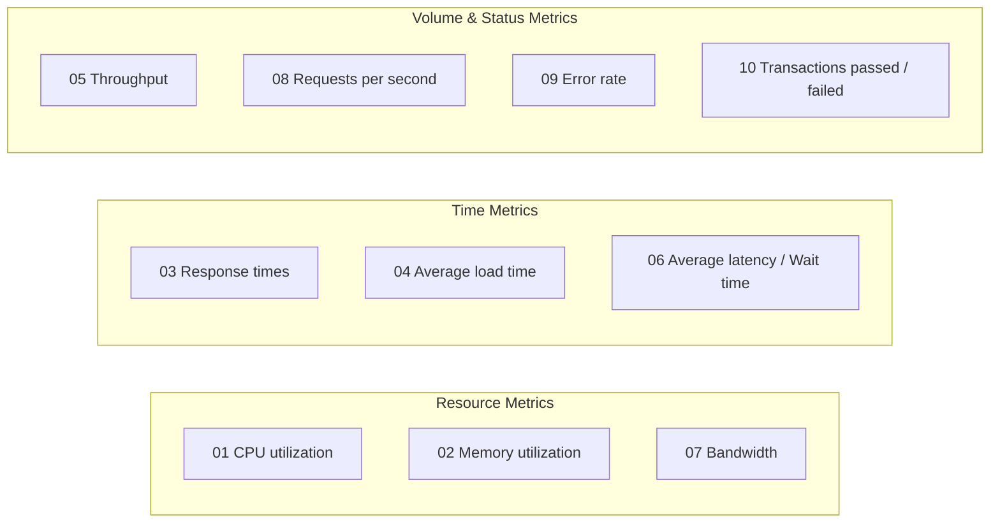
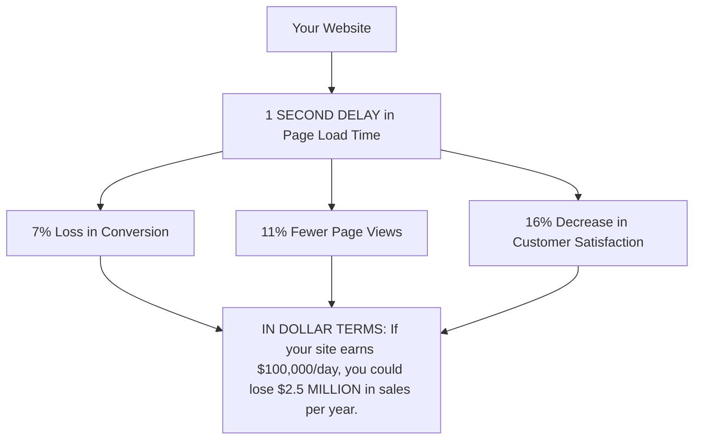
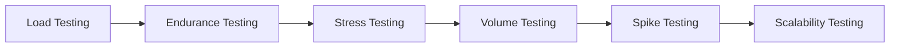
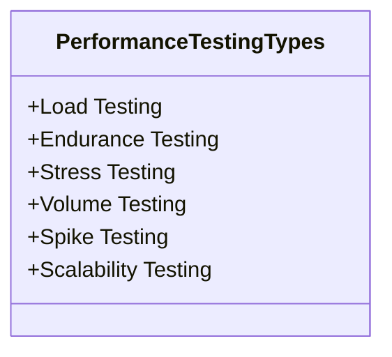
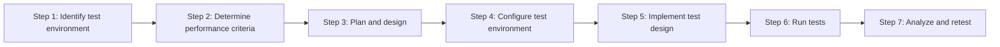

# Software Testing - Performance Testing

- **Author**: Tran Duy Hoang
- **Organization**: Department of Software Engineering, FIT @ HCMUS

---

## Table of Contents

1. [What is Performance Testing?](#1-what-is-performance-testing)
2. [Why to do Performance Testing?](#2-why-to-do-performance-testing)
3. [Types of Performance Testing](#3-types-of-performance-testing)
4. [How to do Performance Testing?](#4-how-to-do-performance-testing)

---

## 1. What is Performance Testing?

### Definition
**Performance testing** is a type of **non-functional testing** that ensures software applications perform properly under their expected workload.

### Main Goals and Focus
- **Main Goal**: 
  - Not to find bugs.
  - To **eliminate performance bottlenecks**.
- **The Focus is on**:
  - **Speed**: Whether the application responds quickly.
  - **Scalability**: The maximum user load the application can handle.
  - **Stability**: If the application is stable under varying loads.

### Common Performance Problems
- **Long load time**: Long initial time to start an application.
- **Poor response time**: Delayed output response to an input.
- **Poor scalability**: Does not support a large enough number of users.
- **Bottlenecks**: Obstacles that degrade overall system performance.

### Example Performance Test Cases
- Verify response time is not more than 4 seconds when 1,000 users access the website simultaneously.
- Verify response time of the Application Under Load is within an acceptable range when network connectivity is slow.
- Check the maximum number of users that the application can handle before it crashes.
- Check database execution time when 500 records are read/written simultaneously.
- Check CPU and memory usage of the application and the database server under peak load conditions.
- Verify response time of the application under low, normal, moderate, and heavy load conditions.

### Performance Testing Metrics

| Metric # | Metric Name | Description |
|---|---|---|
| **01** | **CPU utilization** | Percentage of CPU capacity utilized |
| **02** | **Memory utilization** | Utilization of the primary memory |
| **03** | **Response times** | Time between sending request and receiving response |
| **04** | **Average load time** | Time to complete the loading process |
| **05** | **Throughput** | The number of transactions that can be handled in a second |
| **06** | **Average latency / Wait time** | The time spent by a request in a queue before getting processed |
| **07** | **Bandwidth** | The volume of data transferred per second |
| **08** | **Requests per second (RPS)** | The number of requests handled per second |
| **09** | **Error rate** | The percentage of requests resulting in errors |
| **10** | **Transactions Passed / Failed** | The percentage of passed vs failed transactions |

---

## 2. Why to do Performance Testing?

### Real-world Impact & Financial Statistics
- **User Behavior**: Most users click away after **8 seconds of delay**.
- **Revenue Loss**: **$4.4 billion** in business revenue loss due to poor web application performance.
- **Impact on Revenue**: Aberdeen found that inadequate performance could impact revenue by **up to 9%**.
- **Delay Thresholds**: Business performance begins to suffer at **5.1 seconds** of delay in response times for web applications and **3.9 seconds** for critical applications.
- **Downtime Costs**:
  - A 5-minute downtime of Google.com (19-Aug-13) was estimated to cost as much as **$545,000**.
  - Companies lost an estimated **$1,100 per second** due to an Amazon Web Service outage.

### Impact of 1 Second Delay Diagram

### Summary of Benefits
- Help ensure the software meets expected levels of service and provides a positive user experience.
- Highlight improvements relative to speed, stability, and scalability.
- Absence of testing may lead to performance degradation that damages brand reputation.

---

## 3. Types of Performance Testing

### Overview of Performance Testing Types

### Detailed Breakdown

1. **Load Testing**:
   - Checks the product's ability to perform under anticipated user loads.
   - **Objective**: Identify performance congestion before the software product is launched in the market.

2. **Endurance Testing (Soak Testing)**:
   - Performed to ensure the software can handle expected load over a long period of time.

3. **Stress Testing**:
   - Involves testing a product under extreme workloads to see whether it handles high traffic or not.
   - **Objective**: Identify the **breaking point** of a software product.

4. **Volume Testing**:
   - Large numbers of data are saved in a database and the overall software system's behavior is observed.
   - **Objective**: Check product's performance under varying database volumes.

5. **Spike Testing**:
   - Tests the product's reaction to sudden large spikes in load generated by users.

6. **Scalability Testing**:
   - Software application's effectiveness is determined in scaling up to support an increase in user load.
   - Helps in planning capacity addition to your software system.

---

## 4. How to do Performance Testing?

### The 7-Step Performance Testing Process

---

### Step-by-Step Explanation

#### Step 1 – Identify test environment
- Identify the testing environment and know what testing tools are available at your disposal.
- Understand the details of all the hardware, software, and different network configurations ahead of time.

#### Step 2 – Determine performance criteria
- Identify the general performance metrics.
- Identify the performance success criteria.

#### Step 3 – Plan and design
- Identify key scenarios by considering:
  - User variability
  - Test data
  - Plan performance
- Simulate a variety of use cases.
- Outline what metrics will be gathered.

#### Step 4 – Configure test environment
- Arrange all the necessary testing tools and monitoring resources.

#### Step 5 – Implement test design
- Design performance tests according to performance criteria and metrics.

#### Step 6 – Run tests
- Execute and monitor the performance tests.

#### Step 7 – Analyze and retest
- Analyze the findings and fine-tune the test again to see an increase or decrease in performance.
- Run the tests again using the same or different parameters.
