# Báo Cáo Phát Hiện Lỗi (Bug Reports) - Member 2 (Lê Trung Kiên - 23127075)

## 1. Phạm vi và bằng chứng chạy

- SUT: `http://localhost:3000`; health check `GET /api/products` trả `200 OK`.
- Newman command: `npm run test:api` (exit code `1` vì assertion failures).
- Execution time: `2026-09-03T02:43:08Z` (timestamp trong `summary.json`).
- Kết quả authoritative từ các Newman JSON: 90 assertions, 52 passed, 38 failed; 792 recorded requests, 790 non-pending passes, 2 pending, 0 request failures; 0 runner errors. FR-08 riêng có 262 total, 262 recorded executions, 2 pending.
- Runtime credentials were supplied through an untracked `/tmp` environment and are not included here or in the reports.

The records below include only deviations reproduced by the live SUT. Assertion/status expectations that were not explicitly required by the cited contract (for example, `401` versus `403` for an invalid JWT, or JSON media type for Express parser errors) are not recorded as SUT bugs.

## 2. Danh sách lỗi đã xác nhận

| Bug ID  | Tóm tắt lỗi                                                          | API / yêu cầu                                     | Severity |
| ------- | ----------------------------------------------------------------------- | --------------------------------------------------- | -------- |
| BUG-001 | Product search concatenates input into SQL and leaks SQLite errors      | `GET /api/products`; SEC-05                       | High     |
| BUG-002 | Checkout persists the client-supplied`total_amount`                   | `POST /api/checkout`; FR-08                       | High     |
| BUG-003 | Successful checkout does not clear the user cart                        | `POST /api/checkout`; FR-08                       | High     |
| BUG-004 | Admin order APIs do not enforce`role = 'admin'`                       | `/api/admin/orders`; FR-12 / SEC-03               | Critical |
| BUG-005 | Profile update accepts client-supplied`role` and elevates the account | `PUT /api/users/me`; SEC-06                       | Critical |
| BUG-006 | Admin state machine permits terminal`canceled -> delivered`           | `PUT /api/admin/orders/:id/status`; FR-10 / FR-18 | High     |
| BUG-007 | Empty cart is accepted by checkout                                      | `POST /api/checkout`; FR-08                       | High     |
| BUG-008 | Empty shipping address is accepted by checkout                          | `POST /api/checkout`; FR-08                       | High     |
| BUG-009 | Whitespace-only shipping address is accepted by checkout                | `POST /api/checkout`; FR-08                       | High     |
| BUG-010 | Missing shipping address is accepted by checkout                        | `POST /api/checkout`; FR-08                       | High     |
| BUG-011 | Null shipping address is accepted by checkout                           | `POST /api/checkout`; FR-08                       | High     |
| BUG-012 | Object shipping address is accepted by checkout                         | `POST /api/checkout`; FR-08                       | High     |

## 3. Chi tiết các lỗi

### BUG-001 — SQL injection và database-error leakage trong product search

- **Requirement:** SEC-05 requires parameterized database queries. FR-05 search must return a safe product-search response.
- **Preconditions:** SUT seeded with the default five products; no authentication required.
- **Request(s):**
  - `GET /api/products?search=' AND 1=1 --`
  - `GET /api/products?search=' AND 1=2 --`
  - `GET /api/products?search=' UNION SELECT 1,2,3,4,5 --`
  - `GET /api/products?search=`
  - `GET /api/products?search=null%00byte`
- **Expected:** Input is treated as a search value; boolean probes do not alter the result set, and all responses remain safe JSON without database internals.
- **Actual:** The `1=1` probe returned all five products while `1=2` returned `[]`. UNION, script, and null-byte inputs returned `500 text/html` responses containing SQLite errors.
- **Side effects:** SQL predicates can alter result cardinality and backend SQL error text is disclosed to the client.
- **Newman evidence:** `src/newman/member-2/fr-05.json`, assertions `TC-FR05-AI-017`, `TC-FR05-AI-020`, `TC-FR05-AI-024`, and `TC-FR05-HUMAN-001`; CLI detail: `src/newman/member-2/fr-05.txt`.
- **External issue:** https://github.com/HCMUS-software-testing/HW06/issues/41
  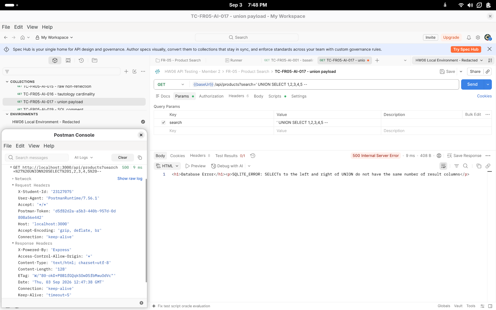

### BUG-002 — Checkout trusts client-controlled total

- **Requirement:** FR-08 requires the backend to recalculate the total from the cart and reject client manipulation.
- **Preconditions:** Fresh registered user; cart contains product `id=1`, price `30,000,000`, quantity `1`.
- **Request:** `POST /api/checkout` with JSON `{"total_amount":1,"shipping_address":"HW06 direct checkout reproduction"}` and the fresh user JWT.
- **Expected:** A successful order stores the server-calculated total `30,000,000`, or rejects the request without persisting the forged value.
- **Actual:** Response was `200`; the created order had `total_amount: 1` and status `pending`.
- **Side effects:** A user can create an order with an arbitrary underpayment (including negative, zero, or non-numeric values observed by Newman).
- **Newman evidence:** `src/newman/member-2/fr-08.json`, assertions `TC-FR08-AI-009`, `TC-FR08-AI-029`, `TC-FR08-AI-030`, and `TC-FR08-AI-035`; CLI detail: `src/newman/member-2/fr-08.txt`.
- **External issue:** https://github.com/HCMUS-software-testing/HW06/issues/43
  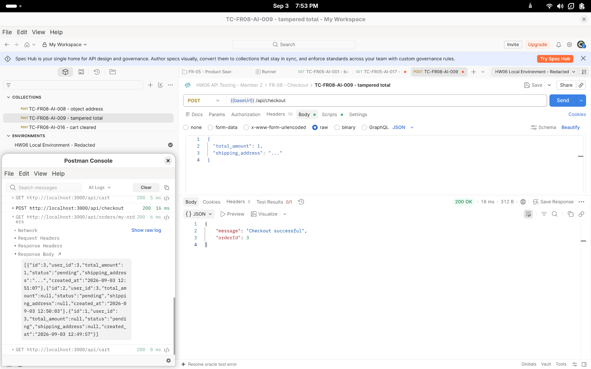

### BUG-003 — Cart remains populated after successful checkout

- **Requirement:** FR-08 requires the cart to be deleted after successful payment/checkout.
- **Preconditions:** Fresh registered user; cart contains one product; valid shipping address.
- **Request:** `POST /api/checkout` with a valid server-total body and the fresh user JWT, followed by `GET /api/cart`.
- **Expected:** Checkout returns success, creates one pending order, and the follow-up cart response is `[]`.
- **Actual:** Checkout returned `200` and created the order, but the follow-up cart still contained the product (`cartCountAfter: 1`).
- **Side effects:** Repeated checkout can reuse the retained cart item and the client sees stale purchase state.
- **Newman evidence:** `src/newman/member-2/fr-08.json`, assertions `TC-FR08-AI-001`, `TC-FR08-AI-016`, `TC-FR08-AI-017`, `TC-FR08-AI-023`, `TC-FR08-AI-024`, `TC-FR08-AI-031`, `TC-FR08-AI-032`, `TC-FR08-AI-033`, and `TC-FR08-AI-034`; CLI detail: `src/newman/member-2/fr-08.txt`.
- **External issue:** https://github.com/HCMUS-software-testing/HW06/issues/45

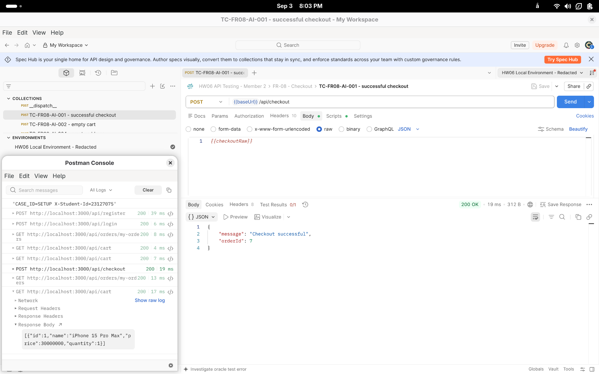

### BUG-004 — Admin order endpoints omit role authorization

- **Requirement:** FR-12 / SEC-03 require every `/api/admin/*` API to require a valid JWT whose role is `admin`.
- **Preconditions:** Fresh ordinary user with an otherwise valid JWT (`role=user`); an existing pending order for the mutation check.
- **Requests:**
  - `GET /api/admin/orders` with the ordinary user JWT.
  - `PUT /api/admin/orders/<captured-order-id>/status` with the ordinary user JWT and `{"status":"confirmed"}`. The order ID is captured from the fresh setup fixture; no fixed ID is used.
- **Expected:** Both requests return `403`; the order remains unchanged.
- **Actual:** Direct reproduction returned `200` for both; the list response was an array and the mutation response was `{"message":"Order status updated"}`.
- **Side effects:** Any authenticated user can read all orders and change order state.
- **Newman evidence:** `src/newman/member-2/fr-18.json`, assertions `TC-FR18-AI-002`, `TC-FR18-AI-007`, `TC-FR18-AI-011`, `TC-FR18-HUMAN-001`, and `TC-FR18-HUMAN-008`; CLI detail: `src/newman/member-2/fr-18.txt`.
- **External issue:** https://github.com/HCMUS-software-testing/HW06/issues/52

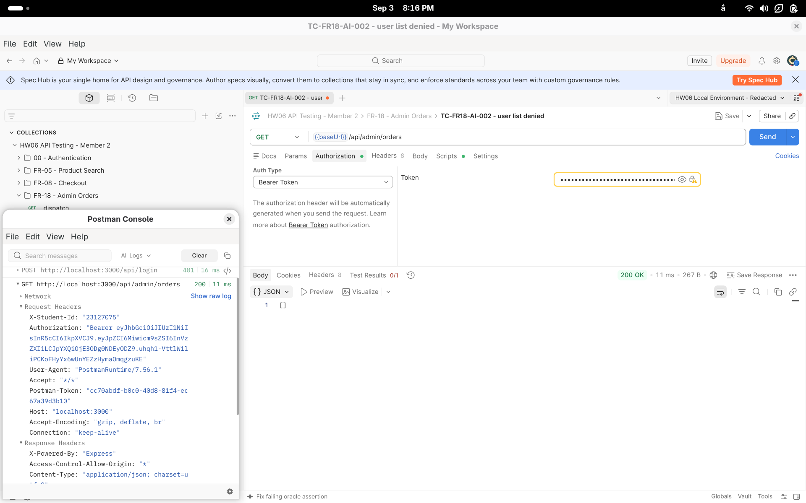

### BUG-005 — Profile role mass assignment enables privilege escalation

- **Requirement:** SEC-06 forbids changing `role` from the client profile API.
- **Preconditions:** Fresh registered ordinary user with a valid user JWT.
- **Request:** `PUT /api/users/me` with `{"name":"HW06 reproduction","shipping_address":"HW06 profile reproduction","phone":"0912345678","role":"admin"}`.
- **Expected:** The request must reject or ignore `role`; a subsequent profile read must still report `role: "user"`.
- **Actual:** Response was `200`; subsequent `GET /api/users/me` reported `role: "admin"`. The same JWT then accessed `GET /api/admin/orders` with `200`.
- **Side effects:** A user can persist an admin role and combine this with BUG-004 to gain administrator access.
- **Newman evidence:** `src/newman/member-2/fr-18.json`, assertion `TC-FR18-AI-014` and `TC-FR18-HUMAN-006`; CLI detail: `src/newman/member-2/fr-18.txt`.
- **External issue:** https://github.com/HCMUS-software-testing/HW06/issues/44

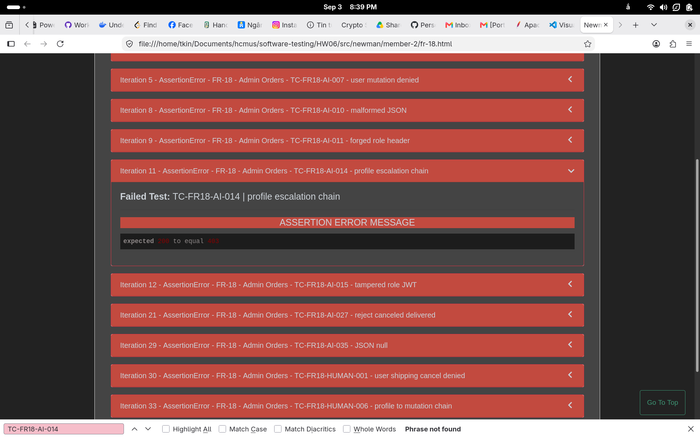

### BUG-006 — Terminal canceled order can transition to delivered

- **Requirement:** FR-10 states that `canceled` is a terminal state and cannot transition to any other state.
- **Preconditions:** Fresh order; admin JWT; order first moved from `pending` to `canceled`.
- **Requests:**
  1. `PUT /api/admin/orders/<captured-id>/status` with `{"status":"canceled"}`.
  2. `PUT /api/admin/orders/<captured-id>/status` with `{"status":"delivered"}`.
- **Expected:** Step 2 returns an error and the order remains `canceled`.
- **Actual:** Both requests returned `200`; the final order state was `delivered`.
- **Side effects:** A canceled order can be marked as delivered, violating the order state machine.
- **Newman evidence:** `src/newman/member-2/fr-18.json`, assertion `TC-FR18-AI-027`; CLI detail: `src/newman/member-2/fr-18.txt`.
- **External issue:** https://github.com/HCMUS-software-testing/HW06/issues/42

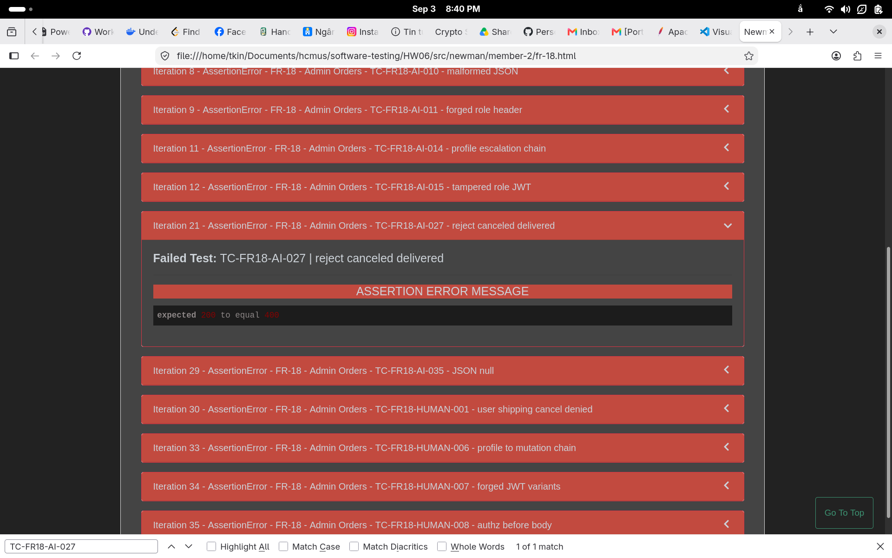

### BUG-007 — Empty cart is accepted by checkout

- **Requirement:** The retained FR-08 traceability oracle requires an empty cart to return `400`, create no order, and leave the cart unchanged.
- **Preconditions:** Fresh registered user with an authenticated empty cart.
- **Request:** `POST /api/checkout` with `{"total_amount":0,"shipping_address":"123 HW06 Street"}` and the fresh user JWT.
- **Expected:** `400` JSON error, zero new orders, and an empty cart.
- **Actual:** The disposable direct reproduction returned `200` with `{"message":"Checkout successful","orderId":117}`, created one order, and left the cart empty.
- **Newman evidence:** `src/newman/member-2/fr-08.json`, failed assertion `TC-FR08-AI-002`; CLI detail: `src/newman/member-2/fr-08.txt`.
- **External issue:** https://github.com/HCMUS-software-testing/HW06/issues/47

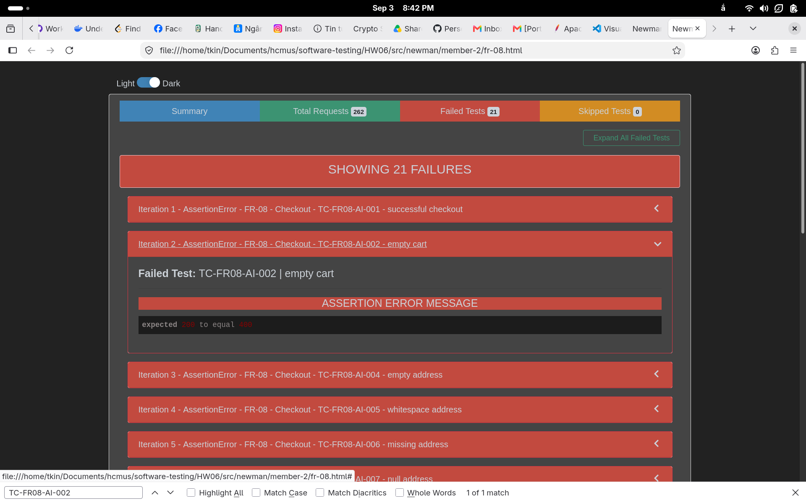

### BUG-008 — Empty shipping address is accepted by checkout

- **Requirement:** The retained FR-08 traceability oracle requires an empty `shipping_address` to return `400`, create no order, and preserve the cart.
- **Preconditions:** Fresh registered user with one product in the cart.
- **Request:** `POST /api/checkout` with `{"total_amount":30000000,"shipping_address":""}` and the fresh user JWT.
- **Expected:** `400` JSON error, zero new orders, and the original cart unchanged.
- **Actual:** The disposable direct reproduction returned `200` with a successful-checkout response, created one order, and left one cart item.
- **Newman evidence:** `src/newman/member-2/fr-08.json`, failed assertion `TC-FR08-AI-004`; CLI detail: `src/newman/member-2/fr-08.txt`.
- **External issue:** https://github.com/HCMUS-software-testing/HW06/issues/46

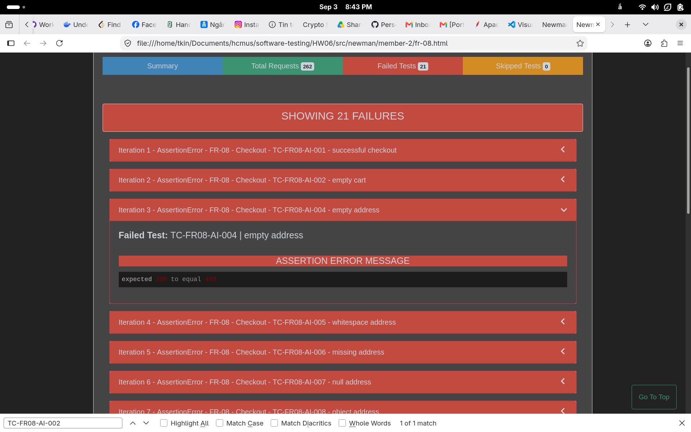

### BUG-009 — Whitespace-only shipping address is accepted by checkout

- **Requirement:** The retained FR-08 traceability oracle requires a whitespace-only `shipping_address` to return `400`, create no order, and preserve the cart.
- **Preconditions:** Fresh registered user with one product in the cart.
- **Request:** `POST /api/checkout` with `{"total_amount":30000000,"shipping_address":"   "}` and the fresh user JWT.
- **Expected:** `400` JSON error, zero new orders, and the original cart unchanged.
- **Actual:** The disposable direct reproduction returned `200` with a successful-checkout response, created one order, and left one cart item.
- **Newman evidence:** `src/newman/member-2/fr-08.json`, failed assertion `TC-FR08-AI-005`; CLI detail: `src/newman/member-2/fr-08.txt`.
- **External issue:** https://github.com/HCMUS-software-testing/HW06/issues/50

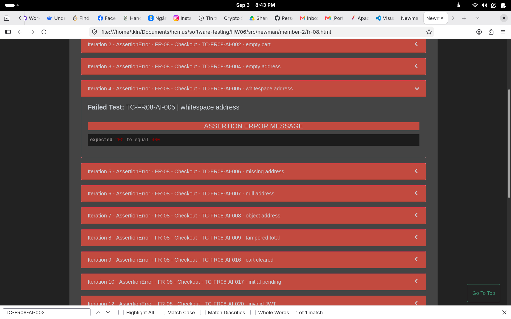

### BUG-010 — Missing shipping address is accepted by checkout

- **Requirement:** The retained FR-08 traceability oracle requires a missing `shipping_address` to return `400`, create no order, and preserve the cart.
- **Preconditions:** Fresh registered user with one product in the cart.
- **Request:** `POST /api/checkout` with `{"total_amount":30000000}` and the fresh user JWT.
- **Expected:** `400` JSON error, zero new orders, and the original cart unchanged.
- **Actual:** The disposable direct reproduction returned `200` with a successful-checkout response, created one order, and left one cart item.
- **Newman evidence:** `src/newman/member-2/fr-08.json`, failed assertion `TC-FR08-AI-006`; CLI detail: `src/newman/member-2/fr-08.txt`.
- **External issue:** https://github.com/HCMUS-software-testing/HW06/issues/48

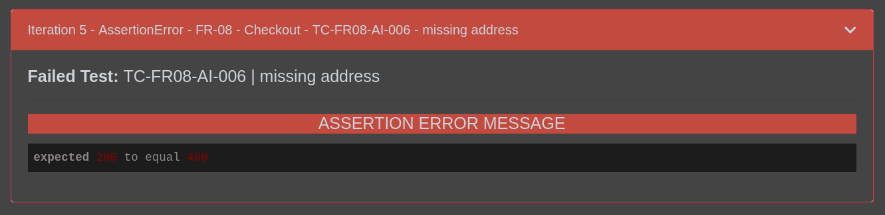

### BUG-011 — Null shipping address is accepted by checkout

- **Requirement:** The retained FR-08 traceability oracle requires a `null` `shipping_address` to return `400`, create no order, and preserve the cart.
- **Preconditions:** Fresh registered user with one product in the cart.
- **Request:** `POST /api/checkout` with `{"total_amount":30000000,"shipping_address":null}` and the fresh user JWT.
- **Expected:** `400` JSON error, zero new orders, and the original cart unchanged.
- **Actual:** The disposable direct reproduction returned `200` with a successful-checkout response, created one order, and left one cart item.
- **Newman evidence:** `src/newman/member-2/fr-08.json`, failed assertion `TC-FR08-AI-007`; CLI detail: `src/newman/member-2/fr-08.txt`.
- **External issue:** https://github.com/HCMUS-software-testing/HW06/issues/49

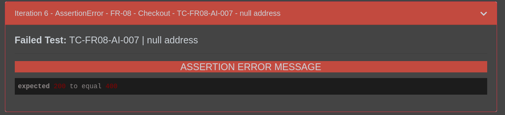

### BUG-012 — Object shipping address is accepted by checkout

- **Requirement:** The retained FR-08 traceability oracle requires a non-string object `shipping_address` to return `400`, create no order, and preserve the cart.
- **Preconditions:** Fresh registered user with one product in the cart.
- **Request:** `POST /api/checkout` with `{"total_amount":30000000,"shipping_address":{"street":"123 HW06 Street"}}` and the fresh user JWT.
- **Expected:** `400` JSON error, zero new orders, and the original cart unchanged.
- **Actual:** The disposable direct reproduction returned `200` with a successful-checkout response, created one order, and left one cart item.
- **Newman evidence:** `src/newman/member-2/fr-08.json`, failed assertion `TC-FR08-AI-008`; CLI detail: `src/newman/member-2/fr-08.txt`.
- **External issue:** https://github.com/HCMUS-software-testing/HW06/issues/51

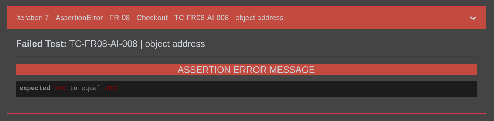

## 4. Không ghi nhận là SUT defect

The remaining Newman assertion failures were retained in the machine-readable reports but not promoted to bug records when they only demonstrated an ungrounded exact status/media-type oracle: invalid JWT responses were `403` rather than the test’s `401`, and malformed JSON / JSON-null parser responses were HTML `400`. The selected FR/SEC text requires rejection or valid authorization, but does not prescribe those exact status/media-type combinations.
