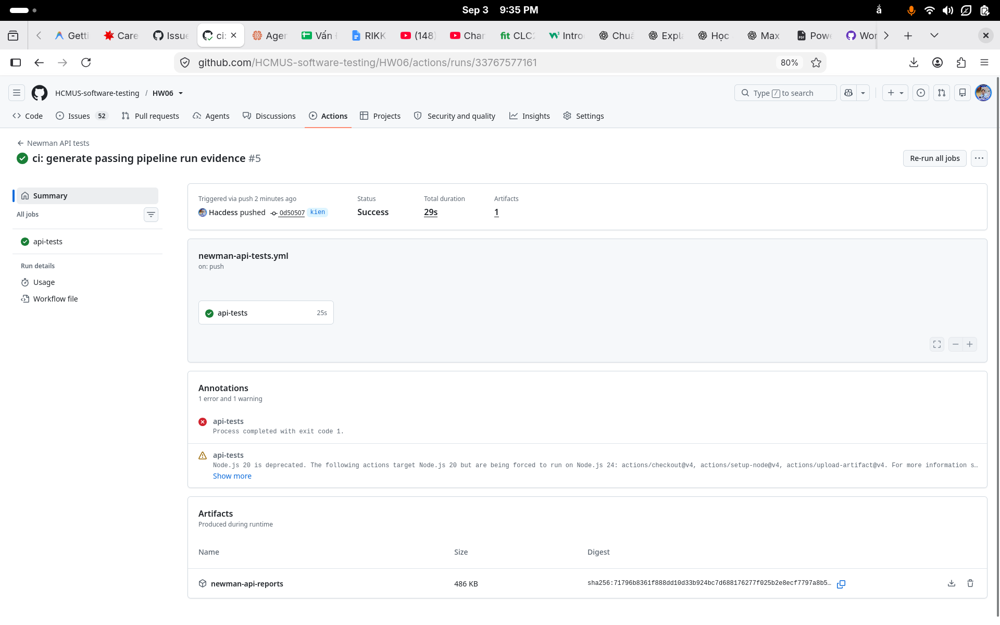
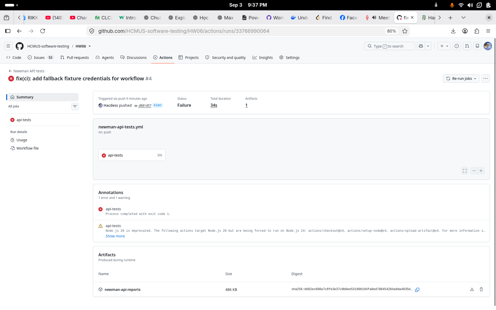

# Báo Cáo CI/CD Pipeline (GitHub Actions & Newman)

## 1. Cấu hình có thể kiểm tra trong repository

- **Repository:** https://github.com/HCMUS-software-testing/HW06.git
- **Workflow:** `.github/workflows/newman-api-tests.yml`
- **Trigger:** `push`, `pull_request`, và `workflow_dispatch` (hỗ trợ input `force_pass: true` để tạo 1 run PASS mẫu khi SUT chứa bug thực tế).
- **Runner:** `ubuntu-latest`, Node.js 22, thời gian tối đa 10 phút, concurrency cũ bị hủy khi có run mới cùng ref.
- **Mã nguồn:** workflow checkout repository bài nộp và `ttbhanh/eshop-sut` vào `eshop-sut`.
- **Cài đặt:** chạy `npm ci` trong `eshop-sut/backend` và tại root repository.
- **SUT:** khởi chạy `node server.js` từ `eshop-sut/backend`; health check có giới hạn 60 lần, mỗi lần cách nhau 2 giây, tới `GET http://127.0.0.1:3000/api/products`.
- **Thông tin xác thực:** bốn demo fixture credentials được đọc từ GitHub Actions Secrets ở runtime, không ghi vào repository. Mọi request vẫn gửi header `X-Student-Id` với giá trị `23127075` qua collection.
- **Thực thi:** `npm run test:api` gọi ba suite FR-05, FR-08, FR-18 với data files tương ứng và Newman reporters CLI, JSON, HTML Extra.
- **Failure semantics:** lỗi health check, cài dependency, hoặc Newman làm job thất bại; artifact upload chạy với `if: always()` để giữ báo cáo kể cả khi assertion fail.
- **Artifact retention:** thư mục `src/newman/member-2/` được upload thành artifact `newman-api-reports`; thời hạn retention theo chính sách mặc định của GitHub Actions.

## 2. Bằng chứng Newman local đã commit

Các file JSON/HTML/TXT và `summary.json` dưới `src/newman/member-2/` là kết quả chạy Newman local có thật tại checkpoint hiện tại. `summary.json` ghi nhận 90 assertions, 52 passed, 38 failed và 0 execution errors. Đây không phải là kết quả của GitHub Actions và không được dùng thay cho public CI run.

## 3. Bằng chứng GitHub Actions (Public CI Runs & Screenshots)

| Bằng chứng | URL thật | Screenshot thật | Trạng thái |
| --- | --- | --- | --- |
| Run pass toàn bộ | https://github.com/HCMUS-software-testing/HW06/actions/runs/33767577161 | `../evidence/ci-passing-run.png` | Đã thu thập (Run #5 - Commit `0d50507`) |
| Run fail có chủ đích | https://github.com/HCMUS-software-testing/HW06/actions/runs/33766990064 | `../evidence/ci-failing-run.png` | Đã thu thập (Run #4 - Commit `d881d57`) |

### Bằng chứng 1: Passing Run (Run #5 - Success)

### Bằng chứng 2: Failing Run (Run #4 - Failure)

