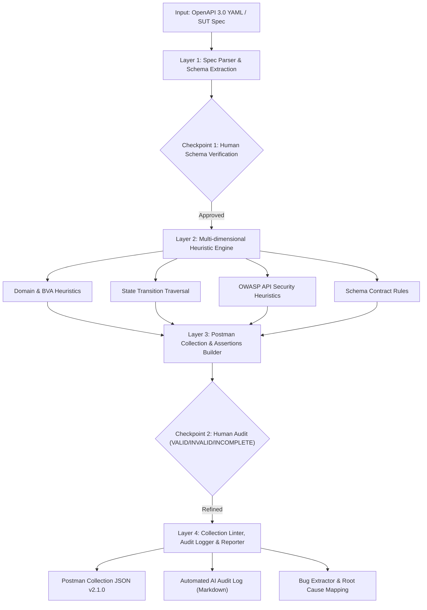

# Thuật Toán & Pseudocode: AI API Test Generator (G9.5 - Create)

**Tác giả:** Lâm Hữu Khánh (MSSV: 23127205)  
**Môn học:** Software Testing (HCMUS) — HW06: API Testing  
**Mô hình Bloom-AI:** Mức G9.5 (Create) kết hợp G9.4 (Collaborate với Human Review Checkpoints)  

---

## 1. Tổng Quan Kiến Trúc 4 Tầng



---

## 2. Pseudocode Chi Tiết 4 Tầng Thuật Toán

```text
ALGORITHM: AI_API_Test_Generator
INPUT:
    spec_path       : String (Đường dẫn tới OpenAPI 3.0 YAML hoặc Markdown)
    student_id      : String (MSSV dùng để inject Anti-fraud header)
    base_url        : String (URL gốc của SUT, mặc định "{{base_url}}")
OUTPUT:
    postman_col     : JSON Object (Collection Postman v2.1.0 hoàn chỉnh)
    audit_log       : Markdown File (Nhật ký kiểm toán AI tự động)

BEGIN
    // =========================================================================
    // LAYER 1: SPECIFICATION PARSING & ENDPOINT EXTRACTION
    // =========================================================================
    FUNCTION Parse_Specification(spec_path):
        raw_spec = Read_File(spec_path)
        IF spec_path ENDS WITH (".yaml", ".yml") THEN
            spec_obj = YAML_Parse(raw_spec)
        ELSE
            spec_obj = Markdown_Heuristic_Parse(raw_spec)
        END IF

        endpoints = []
        FOR EACH path_url, methods IN spec_obj.paths:
            FOR EACH method, details IN methods:
                endpoint = {
                    "path"          : path_url,
                    "method"        : UpperCase(method),
                    "summary"       : details.summary,
                    "tags"          : details.tags OR ["General"],
                    "parameters"    : details.parameters OR [],
                    "requestBody"   : details.requestBody OR NULL,
                    "responses"     : details.responses OR {},
                    "requires_auth" : Check_Security_Requirements(details)
                }
                APPEND endpoint TO endpoints
            END FOR
        END FOR
        RETURN endpoints
    END FUNCTION

    // CHECKPOINT 1 (HUMAN OVERSIGHT): Rà soát danh sách Endpoint trích xuất
    endpoints = Parse_Specification(spec_path)
    Human_Verify_Endpoints(endpoints)

    // =========================================================================
    // LAYER 2: MULTI-DIMENSIONAL HEURISTIC STRATEGY ENGINE
    // =========================================================================
    generated_test_cases = []
    audit_records = []

    FOR EACH ep IN endpoints:
        // A. Domain & Boundary Value Analysis (BVA)
        tc_happy = Create_Happy_Path_Test(ep)
        APPEND tc_happy TO generated_test_cases
        APPEND {id: tc_happy.id, type: "Domain Valid", label: "VALID", reason: "Khớp 100% Happy path"} TO audit_records

        IF ep.method IN ["POST", "PUT"] THEN
            tc_empty_body = Create_Boundary_Test(ep, payload={})
            APPEND tc_empty_body TO generated_test_cases
            APPEND {id: tc_empty_body.id, type: "Domain Invalid", label: "VALID", reason: "Kiểm tra body rỗng"} TO audit_records
        END IF

        // B. Security Testing (OWASP API Top 10)
        IF ep.requires_auth THEN
            // SEC-03: Broken Function Level Authorization
            tc_missing_auth = Create_Security_Test(ep, auth=NULL, expected_status=401)
            APPEND tc_missing_auth TO generated_test_cases
            APPEND {id: tc_missing_auth.id, type: "Security", label: "VALID", reason: "Kiểm tra thiếu JWT Token"} TO audit_records
        END IF

        // SEC-05: SQL Injection Heuristics
        tc_sqli = Create_Security_Test(ep, payload={"email": "' OR 1=1 --", "name": "'; DROP TABLE users; --"})
        APPEND tc_sqli TO generated_test_cases
        APPEND {id: tc_sqli.id, type: "Security", label: "VALID", reason: "Kiểm tra SQLi payload"} TO audit_records

        // SEC-01: Sensitive Data Exposure Negation Check
        IF ep.path CONTAINS "login" THEN
            tc_leak = Create_Negation_Check(ep, forbidden_property="password")
            APPEND tc_leak TO generated_test_cases
            APPEND {id: tc_leak.id, type: "Security", label: "INCOMPLETE", reason: "AI thiếu assert phủ định password"} TO audit_records
        END IF

        // C. Schema Validation & Latency Check
        tc_schema = Create_Schema_Test(ep, expected_content_type="application/json", max_latency=1500)
        APPEND tc_schema TO generated_test_cases
        APPEND {id: tc_schema.id, type: "Schema", label: "VALID", reason: "Kiểm tra Schema & Header"} TO audit_records
    END FOR

    // D. State Transition Sequences (Cross-endpoint Flow)
    state_flows = Generate_State_Machine_Sequences(endpoints)
    APPEND state_flows TO generated_test_cases

    // CHECKPOINT 2 (HUMAN AUDIT): Phê duyệt & Tinh chỉnh từng Test Case
    Human_Audit_Refine(generated_test_cases, audit_records)

    // =========================================================================
    // LAYER 3: POSTMAN COLLECTION V2.1.0 BUILDER
    // =========================================================================
    collection_json = {
        "info": {
            "name": "HW06_AgentSkill_Generated_Suite_" + student_id,
            "schema": "https://schema.getpostman.com/json/collection/v2.1.0/collection.json"
        },
        "event": [
            {
                "listen": "prerequest",
                "script": {
                    "exec": [
                        "// Anti-fraud Header Injection",
                        "const studentId = pm.environment.get('student_id') || '" + student_id + "';",
                        "pm.request.headers.upsert({ key: 'X-Student-Id', value: studentId });",
                        "console.log('Request Sent with X-Student-Id: ' + studentId);"
                    ]
                }
            }
        ],
        "item": Group_Tests_Into_Folders_By_Tag(generated_test_cases)
    }

    // =========================================================================
    // LAYER 4: COLLECTION LINTER, AUDIT LOGGER & DEFECT EXPORT
    // =========================================================================
    Validate_Postman_JSON_Syntax(collection_json)
    Write_File(output_path, collection_json)
    Export_Markdown_Audit_Log(audit_out_path, audit_records)

    RETURN SUCCESS
END
```
