# Báo Cáo Lỗi & Lỗ Hổng Phát Hiện Được (Defect & Security Report)

**Sinh viên thực hiện:** Lâm Hữu Khánh — MSSV: `23127205`  
**Vai trò nhóm:** Thành viên 1  
**Môn học:** Kiểm thử phần mềm (Software Testing) — HW06: API Testing  
**Ngày lập báo cáo:** 31/08/2026  
**Phân hệ phụ trách:**
- **Pool A:** FR-02: Đăng nhập & Khóa tài khoản (`POST /api/login`)
- **Pool B:** FR-07: Giỏ hàng (`GET /api/cart`, `POST /api/cart`)
- **Pool C:** FR-15: Quản lý sản phẩm CRUD (`POST/GET/PUT/DELETE /api/products`)

---

## 1. Bảng Tổng Hợp Danh Sách Lỗi (Defect Summary Matrix)

| Bug ID | API Endpoint | Tiêu đề lỗi (Defect Title) | Phân loại (Type) | Mức độ (Severity) | Vị trí mã nguồn SUT | Trạng thái |
|:---:|---|---|---|:---:|---|:---:|
| **`BUG-FR02-01`** | `POST /api/login` | Bộ đếm `login_attempts` cộng 2 mỗi lần sai thay vì cộng 1 | Business Logic | **High** | `server.js:L54` | Logged (Issue #1) |
| **`BUG-FR02-02`** | `POST /api/login` | Thời gian khóa tài khoản là 180s (3 phút) thay vì 30s | Business Logic | **Medium** | `server.js:L57` | Logged (Issue #2) |
| **`BUG-FR02-03`** | `POST /api/login` | Thiếu validation regex định dạng Email, trả về 401 thay vì 400 | Data Validation | **Low** | `server.js:L33` | Logged (Issue #3) |
| **`BUG-FR02-04`** | `POST /api/login` | **Lỗ hổng bảo mật:** Response đăng nhập trả về nguyên vẹn trường `password` | Security (SEC-01) | **Critical** | `server.js:L52` | Logged (Issue #4) |
| **`BUG-FR07-01`** | `POST /api/cart` | Backend không kiểm tra số lượng âm hoặc bằng 0 (`quantity <= 0`) | Data Validation | **High** | `server.js:L290-295` | Logged (Issue #5) |
| **`BUG-FR07-02`** | `POST /api/cart` | Thêm trùng sản phẩm bị thêm thành dòng mới thay vì cộng dồn số lượng | Business Logic | **Medium** | `server.js:L293` | Logged (Issue #6) |
| **`BUG-FR07-03`** | `/api/cart` | Thiếu hoàn toàn API Cập nhật số lượng (`PUT`) và Xóa item (`DELETE`) | Missing Feature | **Critical** | `server.js:L280-296` | Logged (Issue #7) |
| **`BUG-FR07-04`** | `/api/cart` | Giỏ hàng lưu in-memory `userCarts`, mất sạch dữ liệu khi server restart | Architecture | **High** | `server.js:L284-295` | Logged (Issue #8) |
| **`BUG-FR15-01`** | `POST/PUT/DELETE /api/products` | **Lỗ hổng bảo mật:** Thiếu middleware xác thực Admin (`authenticateToken`) | Security (SEC-03) | **Critical** | `server.js:L167,179,191` | Logged (Issue #9) |
| **`BUG-FR15-02`** | `GET /api/products/:id` | Ép kiểu `price` sang String ở các sản phẩm có ID chẵn | Data Type Bug | **Medium** | `server.js:L162` | Logged (Issue #10) |
| **`BUG-FR15-03`** | `POST /api/products` | Cho phép tạo sản phẩm với giá âm (`price < 0`) và tên rỗng | Data Validation | **High** | `server.js:L167-176` | Logged (Issue #11) |
| **`BUG-FR15-04`** | `POST /api/admin/import-products` | Thiếu kiểm tra vai trò `admin`, user thường vẫn import được sản phẩm | Security (SEC-03) | **High** | `server.js:L199` | Logged (Issue #12) |

---

## 2. Chi Tiết Các Báo Cáo Lỗi Phân Hệ FR-02 (Đăng Nhập & Khóa Tài Khoản)

---

### BUG-FR02-01: Bộ đếm `login_attempts` tăng 2 đơn vị mỗi lần đăng nhập sai

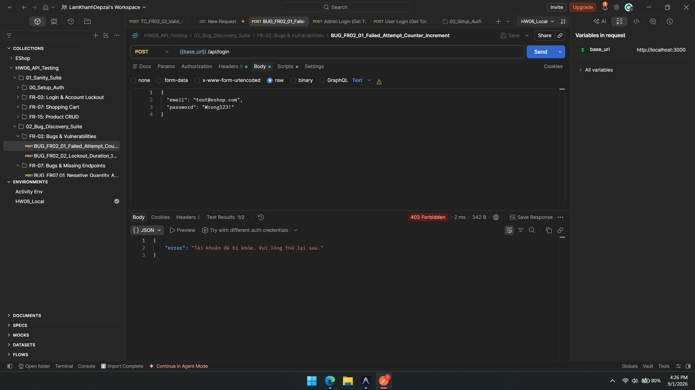
- **Mã lỗi:** `BUG-FR02-01`
- **API Endpoint:** `POST /api/login`
- **Mức độ nghiêm trọng:** **High** (Lỗi logic nghiệp vụ ảnh hưởng trực tiếp đến trải nghiệm người dùng)
- **Mô tả:** Theo đặc tả SRS Mục 2 (FR-02): *"Sau mỗi lần đăng nhập sai, hệ thống tăng bộ đếm lên đúng 1 đơn vị. Nếu đăng nhập sai từ 3 lần trở lên liên tiếp, tài khoản bị tạm khóa."* Tuy nhiên, thực tế khi người dùng nhập sai mật khẩu 1 lần, bộ đếm trong CSDL tăng từ `0` lên `2`. Chỉ cần sai 2 lần là bộ đếm đạt `4 >= 3` và tài khoản bị khóa ngay lập tức.
- **Điều kiện tiên quyết:** Tài khoản `lockout_target@eshop.com` đang ở trạng thái bình thường (`login_attempts = 0`).
- **Các bước tái hiện (Steps to Reproduce):**
  1. Gửi request `POST http://localhost:3000/api/login` với body:
     ```json
     { "email": "lockout_target@eshop.com", "password": "WrongPassword1!" }
     ```
  2. Kiểm tra giá trị `login_attempts` trong SQLite: giá trị là `2`.
  3. Gửi tiếp lần 2 với mật khẩu sai `WrongPassword2!`.
  4. Hệ thống chuyển tài khoản sang trạng thái khóa và trả về HTTP `403 Forbidden`.
- **Kết quả thực tế (Actual Result):** Tài khoản bị khóa chỉ sau 2 lần nhập sai (thay vì 3 lần).
- **Kết quả mong đợi (Expected Result):** Sau lần 1: `login_attempts = 1`, sau lần 2: `login_attempts = 2`, sau lần 3 mới bị khóa.
- **Phân tích nguyên nhân gốc (Root Cause):**
  Tại [server.js](file:///d:/LEARNING/CNTT_CLC%282023-2027%29/NamBa/HK3/Ki%E1%BB%83m%20th%E1%BB%AD%20ph%E1%BA%A7n%20m%E1%BB%81m/HW/HW6/HW06/eshop-sut/backend/server.js#L54):
  ```javascript
  const newAttempts = user.login_attempts + 2; // Lỗi: cộng 2 thay vì cộng 1
  ```
- **Đề xuất khắc phục (Proposed Fix):**
  ```javascript
  const newAttempts = (user.login_attempts || 0) + 1;
  ```

---

### BUG-FR02-02: Thời gian khóa tài khoản là 180s (3 phút) thay vì 30s

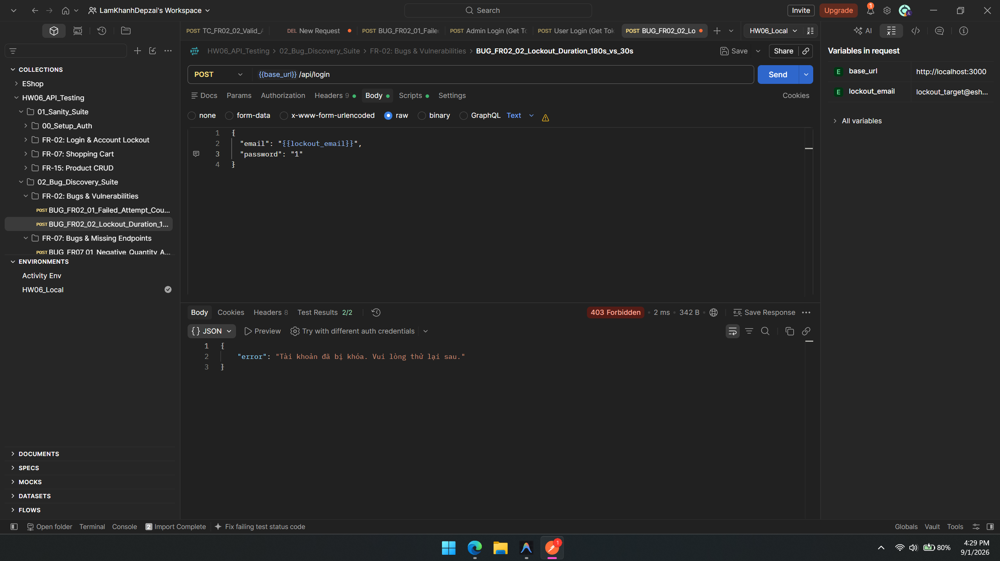
- **Mã lỗi:** `BUG-FR02-02`
- **API Endpoint:** `POST /api/login`
- **Mức độ nghiêm trọng:** **Medium**
- **Mô tả:** SRS FR-02 quy định trong môi trường thử nghiệm: *"Thời gian tạm khóa tài khoản khi đăng nhập sai từ 3 lần trở lên là 30 giây."* Mã nguồn backend thiết lập thời gian khóa là `180000 ms` (3 phút).
- **Các bước tái hiện:**
  1. Gửi liên tiếp 2 request sai đến `POST /api/login` để kích hoạt khóa tài khoản.
  2. Quan sát giá trị `lockedUntil` trả về hoặc lưu trong CSDL: chênh lệch `180000ms` so với `Date.now()`.
- **Kết quả thực tế:** Người dùng bị khóa trong 180 giây (3 phút).
- **Kết quả mong đợi:** Người dùng chỉ bị khóa trong 30 giây (30000 ms).
- **Phân tích nguyên nhân gốc:**
  Tại [server.js](file:///d:/LEARNING/CNTT_CLC%282023-2027%29/NamBa/HK3/Ki%E1%BB%83m%20th%E1%BB%AD%20ph%E1%BA%A7n%20m%E1%BB%81m/HW/HW6/HW06/eshop-sut/backend/server.js#L57):
  ```javascript
  lockedUntil = new Date(Date.now() + 180000).toISOString(); // 180s thay vì 30s
  ```
- **Đề xuất khắc phục:**
  ```javascript
  lockedUntil = new Date(Date.now() + 30000).toISOString(); // Khóa đúng 30 giây
  ```

---

### BUG-FR02-03: Thiếu validation định dạng Email, trả về 401 thay vì 400

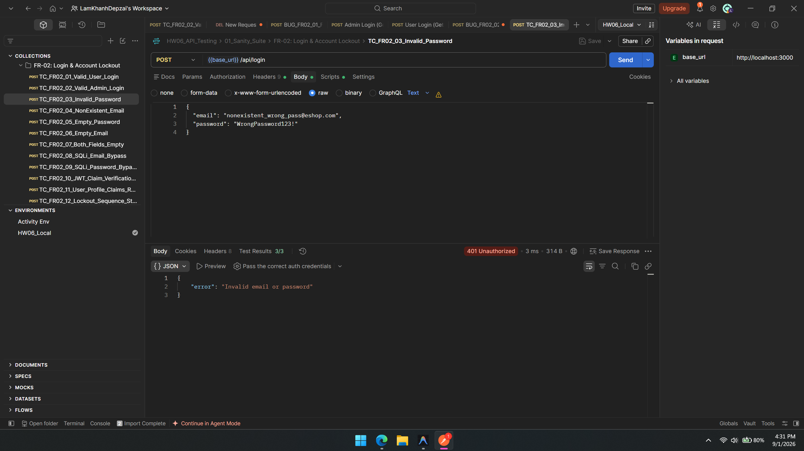
- **Mã lỗi:** `BUG-FR02-03`
- **API Endpoint:** `POST /api/login`
- **Mức độ nghiêm trọng:** **Low**
- **Mô tả:** Khi gửi body đăng nhập với email sai định dạng (ví dụ `testeshop.com` không có `@` hoặc chuỗi rỗng), server không thực hiện xác thực định dạng đầu vào (Input Format Validation) ở tầng Controller mà trực tiếp truy vấn CSDL SQLite rồi trả về `401 Unauthorized`.
- **Kết quả thực tế:** HTTP `401 Unauthorized` với message `"Invalid email or password"`.
- **Kết quả mong đợi:** HTTP `400 Bad Request` với message `"Email format is invalid"`.
- **Phân tích nguyên nhân gốc:** Tại [server.js:L33-40](file:///d:/LEARNING/CNTT_CLC%282023-2027%29/NamBa/HK3/Ki%E1%BB%83m%20th%E1%BB%AD%20ph%E1%BA%A7n%20m%E1%BB%81m/HW/HW6/HW06/eshop-sut/backend/server.js#L33), route handler không sử dụng regex kiểm tra email trước khi gọi `db.get`.

---

### BUG-FR02-04: Lỗ hổng bảo mật nghiêm trọng — Rò rỉ mật khẩu trong Response Login

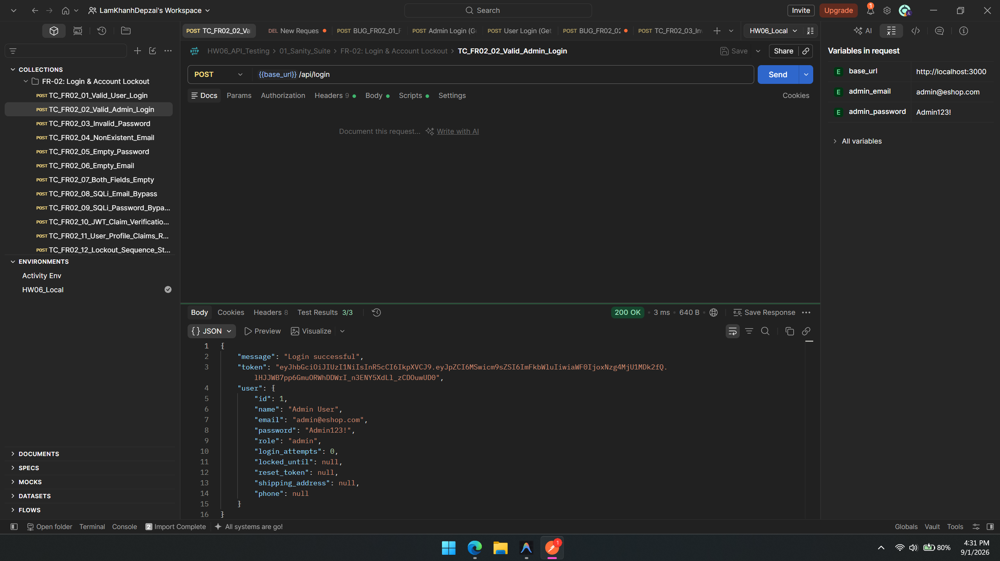
- **Mã lỗi:** `BUG-FR02-04`
- **API Endpoint:** `POST /api/login`
- **Mức độ nghiêm trọng:** **Critical** (Lỗ hổng bảo mật loại SEC-01 — Data Exposure / OWASP API Security Top 10)
- **Mô tả:** Khi đăng nhập thành công, server trả về object `user`. Do backend lấy nguyên dòng dữ liệu từ `SELECT * FROM users` mà không lọc bỏ trường nhạy cảm, mật khẩu của người dùng đã bị gửi trả về client.
- **Request:**
  ```http
  POST /api/login HTTP/1.1
  Content-Type: application/json

  { "email": "test@eshop.com", "password": "Test1234!" }
  ```
- **Response thực tế (Actual Body):**
  ```json
  {
    "message": "Login successful",
    "token": "eyJhbGciOiJIUzI1NiIsInR5cCI6IkpXVCJ9...",
    "user": {
      "id": 2,
      "name": "Test User",
      "email": "test@eshop.com",
      "password": "Test1234!",
      "role": "user",
      "login_attempts": 0,
      "locked_until": null
    }
  }
  ```
- **Kết quả mong đợi:** Object `user` tuyệt đối **KHÔNG ĐƯỢC CHỨA** trường `password`.
- **Phân tích nguyên nhân gốc:**
  Tại [server.js:L52](file:///d:/LEARNING/CNTT_CLC%282023-2027%29/NamBa/HK3/Ki%E1%BB%83m%20th%E1%BB%AD%20ph%E1%BA%A7n%20m%E1%BB%81m/HW/HW6/HW06/eshop-sut/backend/server.js#L52):
  ```javascript
  res.json({ message: "Login successful", token, user }); // user chứa nguyên cột password
  ```
- **Đề xuất khắc phục:**
  ```javascript
  const { password, ...safeUser } = user;
  res.json({ message: "Login successful", token, user: safeUser });
  ```

---

## 3. Chi Tiết Các Báo Cáo Lỗi Phân Hệ FR-07 (Giỏ Hàng)

---

### BUG-FR07-01: Cho phép thêm sản phẩm vào giỏ hàng với số lượng âm hoặc bằng 0

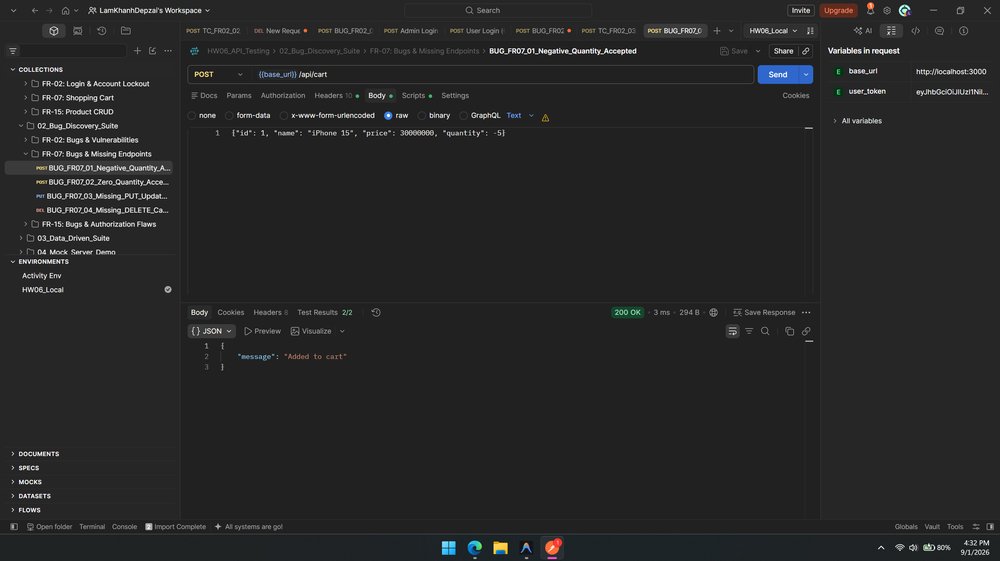
- **Mã lỗi:** `BUG-FR07-01`
- **API Endpoint:** `POST /api/cart`
- **Mức độ nghiêm trọng:** **High** (Lỗi toàn vẹn nghiệp vụ kinh doanh)
- **Mô tả:** Khi gửi request thêm sản phẩm vào giỏ hàng với `quantity: -5` hoặc `quantity: 0`, server không kiểm tra điều kiện `quantity > 0` mà trực tiếp lưu vào giỏ hàng và trả về `200 OK`.
- **Request:**
  ```http
  POST /api/cart HTTP/1.1
  Authorization: Bearer <valid_user_token>
  Content-Type: application/json

  { "id": 1, "name": "iPhone 15", "price": 30000000, "quantity": -5 }
  ```
- **Response thực tế:** HTTP `200 OK` với body `{"message": "Added to cart"}`. Khi `GET /api/cart`, item trong giỏ có số lượng `-5`.
- **Kết quả mong đợi:** HTTP `400 Bad Request` với thông báo lỗi `"Số lượng sản phẩm phải lớn hơn 0"`.
- **Phân tích nguyên nhân gốc:**
  Tại [server.js:L290-295](file:///d:/LEARNING/CNTT_CLC%282023-2027%29/NamBa/HK3/Ki%E1%BB%83m%20th%E1%BB%AD%20ph%E1%BA%A7n%20m%E1%BB%81m/HW/HW6/HW06/eshop-sut/backend/server.js#L290):
  ```javascript
  app.post("/api/cart", authenticateToken, (req, res) => {
    const userId = req.user.id;
    if (!userCarts[userId]) userCarts[userId] = [];
    userCarts[userId].push(req.body); // Không validate req.body.quantity > 0
    res.json({ message: "Added to cart" });
  });
  ```
- **Đề xuất khắc phục:**
  ```javascript
  const { id, quantity } = req.body;
  if (!quantity || quantity <= 0 || !Number.isInteger(quantity)) {
    return res.status(400).json({ error: "Số lượng sản phẩm phải là số nguyên dương" });
  }
  ```

---

### BUG-FR07-02: Thêm trùng sản phẩm bị nhân bản dòng thay vì cộng dồn số lượng

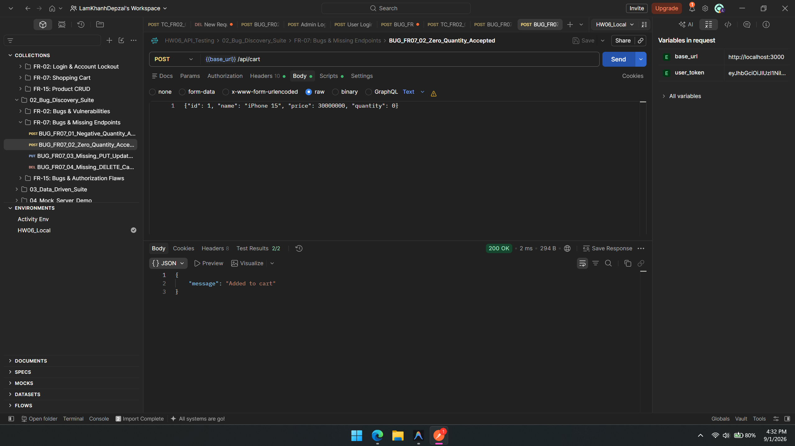
- **Mã lỗi:** `BUG-FR07-02`
- **API Endpoint:** `POST /api/cart`
- **Mức độ nghiêm trọng:** **Medium**
- **Mô tả:** Theo đặc tả giỏ hàng: Khi người dùng thêm sản phẩm đã có sẵn trong giỏ, hệ thống phải tìm item đó và cộng dồn số lượng (`quantity = existing.quantity + new.quantity`). Thực tế SUT chỉ dùng `push()` nên giỏ hàng bị nhân bản thành 2 dòng riêng biệt có cùng product ID.
- **Phân tích nguyên nhân gốc:** `server.js:L293` thiếu bước kiểm tra `find(item => item.id === req.body.id)`.

---

### BUG-FR07-03: Thiếu hoàn toàn API Cập nhật số lượng (`PUT`) và Xóa item (`DELETE`)

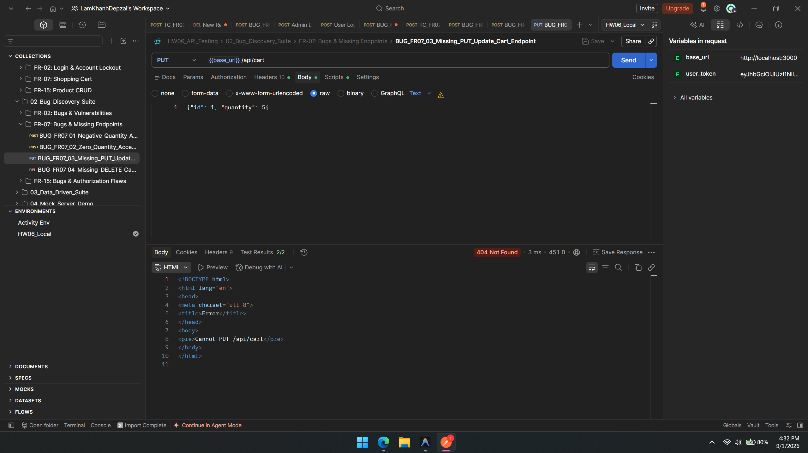
- **Mã lỗi:** `BUG-FR07-03`
- **API Endpoint:** `PUT /api/cart` & `DELETE /api/cart/:id`
- **Mức độ nghiêm trọng:** **Critical** (Thiếu hụt tính năng cốt lõi theo đặc tả hệ thống thương mại điện tử)
- **Mô tả:** Hệ thống SUT hoàn toàn không cài đặt bất kỳ route nào để người dùng sửa số lượng hoặc xóa một sản phẩm khỏi giỏ hàng. Mọi request `PUT /api/cart` và `DELETE /api/cart/:id` đều trả về HTTP `404 Not Found`.
- **Phân tích nguyên nhân gốc:** Trong `server.js`, phân hệ Cart chỉ có duy nhất 2 endpoint là `GET /api/cart` và `POST /api/cart`.

---

### BUG-FR07-04: Giỏ hàng lưu in-memory, mất sạch dữ liệu khi server restart

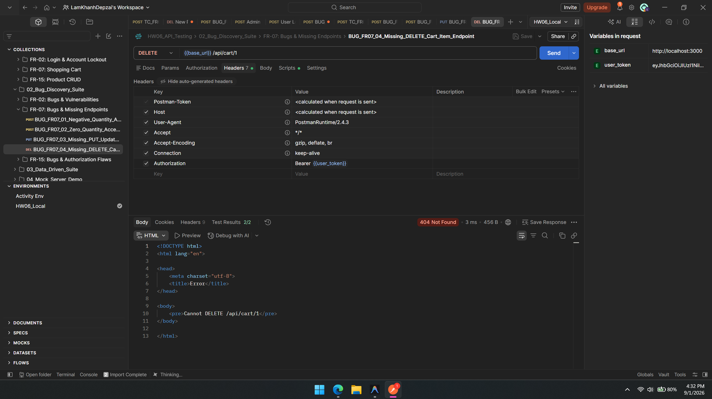
- **Mã lỗi:** `BUG-FR07-04`
- **API Endpoint:** `GET/POST /api/cart`
- **Mức độ nghiêm trọng:** **High** (Lỗi kiến trúc phần mềm)
- **Mô tả:** Dữ liệu giỏ hàng được lưu trữ tạm trong biến Javascript in-memory `userCarts = {}`. Khi server Node.js khởi động lại hoặc crash, toàn bộ giỏ hàng của tất cả người dùng bị xóa trắng.
- **Đề xuất khắc phục:** Lưu trữ giỏ hàng vào bảng `cart_items` trong CSDL SQLite.

---

## 4. Chi Tiết Các Báo Cáo Lỗi Phân Hệ FR-15 (Quản Lý Sản Phẩm CRUD)

---

### BUG-FR15-01: Lỗ hổng bảo mật nghiêm trọng — Thiếu Middleware xác thực Admin trên CRUD Sản Phẩm

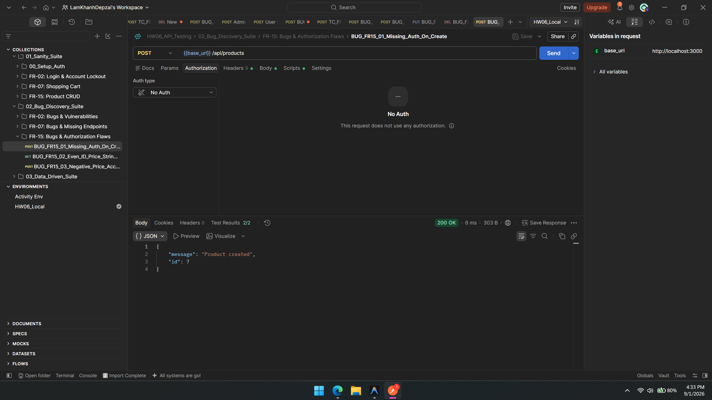
- **Mã lỗi:** `BUG-FR15-01`
- **API Endpoint:** `POST /api/products`, `PUT /api/products/:id`, `DELETE /api/products/:id`
- **Mức độ nghiêm trọng:** **Critical** (Lỗ hổng bảo mật loại SEC-03 — Broken Object Level Authorization / Missing Authentication)
- **Mô tả:** Theo đặc tả SRS FR-15: Chỉ có người dùng có vai trò **Admin** mới được phép Thêm mới, Cập nhật và Xóa sản phẩm. Tuy nhiên, mã nguồn backend Express **hoàn toàn quên gắn middleware `authenticateToken`** vào cả 3 route này.
- **Các bước tái hiện:**
  1. Mở Postman hoặc Terminal, gửi request `DELETE http://localhost:3000/api/products/1` **mà không đính kèm bất kỳ Token xác thực nào**.
  2. Server thực thi câu lệnh SQL xóa và trả về `200 OK` (`{"message": "Product deleted"}`).
- **Kết quả thực tế:** Bất kỳ ai trên Internet cũng có thể xóa sạch toàn bộ sản phẩm trong CSDL mà không cần đăng nhập.
- **Kết quả mong đợi:** HTTP `401 Unauthorized` (nếu không có token) hoặc `403 Forbidden` (nếu là user thường).
- **Phân tích nguyên nhân gốc:**
  Tại [server.js:L167, L179, L191](file:///d:/LEARNING/CNTT_CLC%282023-2027%29/NamBa/HK3/Ki%E1%BB%83m%20th%E1%BB%AD%20ph%E1%BA%A7n%20m%E1%BB%81m/HW/HW6/HW06/eshop-sut/backend/server.js#L167):
  ```javascript
  app.post("/api/products", (req, res) => { ... });      // Thiếu authenticateToken
  app.put("/api/products/:id", (req, res) => { ... });   // Thiếu authenticateToken
  app.delete("/api/products/:id", (req, res) => { ... });// Thiếu authenticateToken
  ```
- **Đề xuất khắc phục:**
  ```javascript
  const requireAdmin = (req, res, next) => {
    if (req.user && req.user.role === 'admin') return next();
    return res.status(403).json({ error: "Yêu cầu quyền Quản trị viên (Admin)" });
  };

  app.post("/api/products", authenticateToken, requireAdmin, (req, res) => { ... });
  app.put("/api/products/:id", authenticateToken, requireAdmin, (req, res) => { ... });
  app.delete("/api/products/:id", authenticateToken, requireAdmin, (req, res) => { ... });
  ```

---

### BUG-FR15-02: Lỗi ép kiểu `price` sang String ở các sản phẩm có ID chẵn

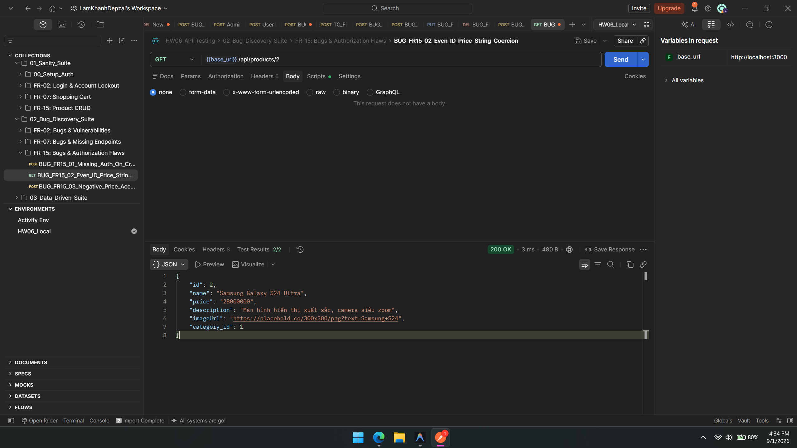
- **Mã lỗi:** `BUG-FR15-02`
- **API Endpoint:** `GET /api/products/:id`
- **Mức độ nghiêm trọng:** **Medium** (Lỗi vi phạm hợp đồng dữ liệu API Schema Contract)
- **Mô tả:** Khi gọi API lấy chi tiết sản phẩm, nếu sản phẩm có `id` là số chẵn (ví dụ ID 2, ID 4, ID 6), server cố tình ép kiểu trường `price` sang kiểu String (`"25000000"` thay vì `25000000`).
- **Phân tích nguyên nhân gốc:**
  Tại [server.js:L162](file:///d:/LEARNING/CNTT_CLC%282023-2027%29/NamBa/HK3/Ki%E1%BB%83m%20th%E1%BB%AD%20ph%E1%BA%A7n%20m%E1%BB%81m/HW/HW6/HW06/eshop-sut/backend/server.js#L162):
  ```javascript
  if (row.id % 2 === 0) row.price = row.price.toString(); // Đoạn code gây lỗi ép kiểu
  ```
- **Đề xuất khắc phục:** Xóa bỏ hoàn toàn dòng `if (row.id % 2 === 0)` để giữ nguyên kiểu `number` của trường `price`.

---

### BUG-FR15-03: Cho phép tạo sản phẩm với giá âm (`price < 0`) và tên rỗng

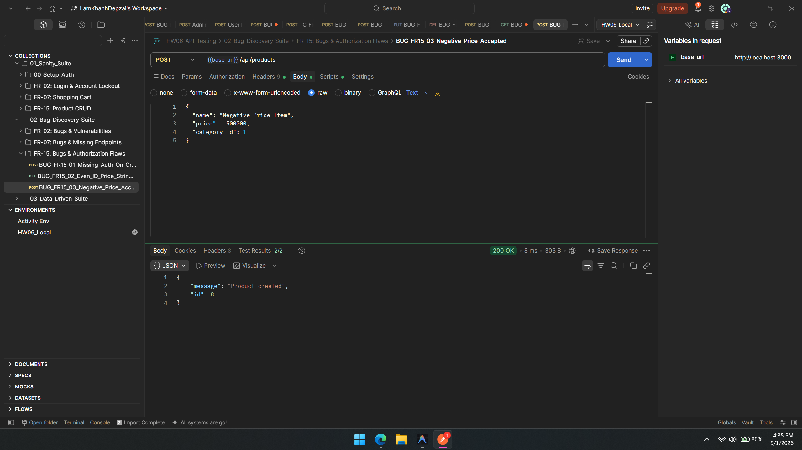
- **Mã lỗi:** `BUG-FR15-03`
- **API Endpoint:** `POST /api/products`
- **Mức độ nghiêm trọng:** **High**
- **Mô tả:** Backend không kiểm tra các ràng buộc nghiệp vụ cơ bản:
  - Cho phép `price: -500000` (giá âm).
  - Cho phép `name: ""` (tên rỗng).
  - Cho phép `category_id` không tồn tại trong bảng `categories`.
- **Phân tích nguyên nhân gốc:** Tại `server.js:L167-176`, handler nhận dữ liệu từ `req.body` và truyền thẳng vào câu lệnh `INSERT INTO products` mà không có bước validation logic.

---

### BUG-FR15-04: API Import Sản phẩm thiếu kiểm tra vai trò Admin

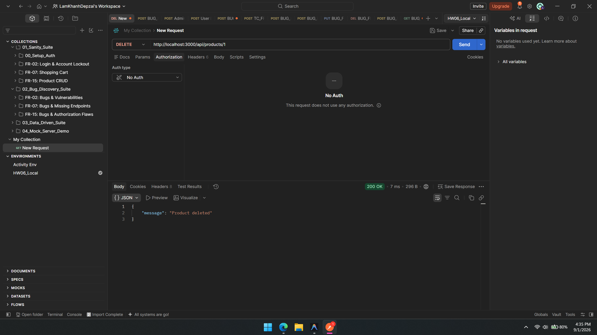
- **Mã lỗi:** `BUG-FR15-04`
- **API Endpoint:** `POST /api/admin/import-products`
- **Mức độ nghiêm trọng:** **High** (Lỗ hổng leo thang đặc quyền - Privilege Escalation)
- **Mô tả:** Route `/api/admin/import-products` có gắn middleware `authenticateToken`, nhưng **không kiểm tra `req.user.role === 'admin'`**. Một tài khoản khách hàng thông thường (`role = 'user'`) chỉ cần đăng nhập lấy token là có thể gọi API này để chèn hàng loạt sản phẩm vào CSDL.
- **Phân tích nguyên nhân gốc:**
  Tại [server.js:L199](file:///d:/LEARNING/CNTT_CLC%282023-2027%29/NamBa/HK3/Ki%E1%BB%83m%20th%E1%BB%AD%20ph%E1%BA%A7n%20m%E1%BB%81m/HW/HW6/HW06/eshop-sut/backend/server.js#L199):
  ```javascript
  app.post("/api/admin/import-products", authenticateToken, (req, res) => {
    // Không có bước: if (req.user.role !== 'admin') return res.status(403).json(...);
  ```
