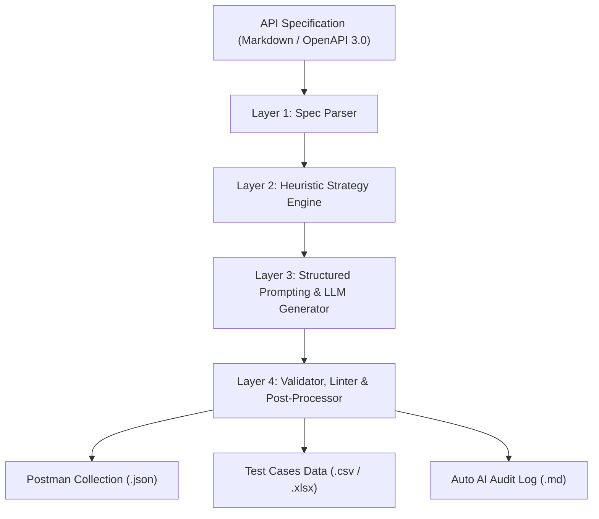

# Agent Skill: AI API Test Generator (G9.5 - Create)

## 1. Tổng Quan

Skill này là một bộ sinh test tự động (Automated API Test Generator) được xây dựng theo kiến trúc 4 tầng, nhận đầu vào là đặc tả API (OpenAPI YAML hoặc Markdown) và xuất ra:
1. File Postman Collection JSON hoàn chỉnh (`.postman_collection.json`) kèm Pre-request & Test scripts.
2. File Test Cases Excel / CSV với phân loại độ phủ.
3. Báo cáo kiểm toán AI tự động.
4. Báo cáo bug tự động phát hiện được sau khi thực thi.

## 2. Kiến Trúc 4 Tầng



## 3. Cách Sử Dụng Script

```bash
# Chạy script sinh test cho đặc tả API
python agent-skill/skill.py --spec eshop-sut/api_specification.md --output postman/generated_collection.json
```
