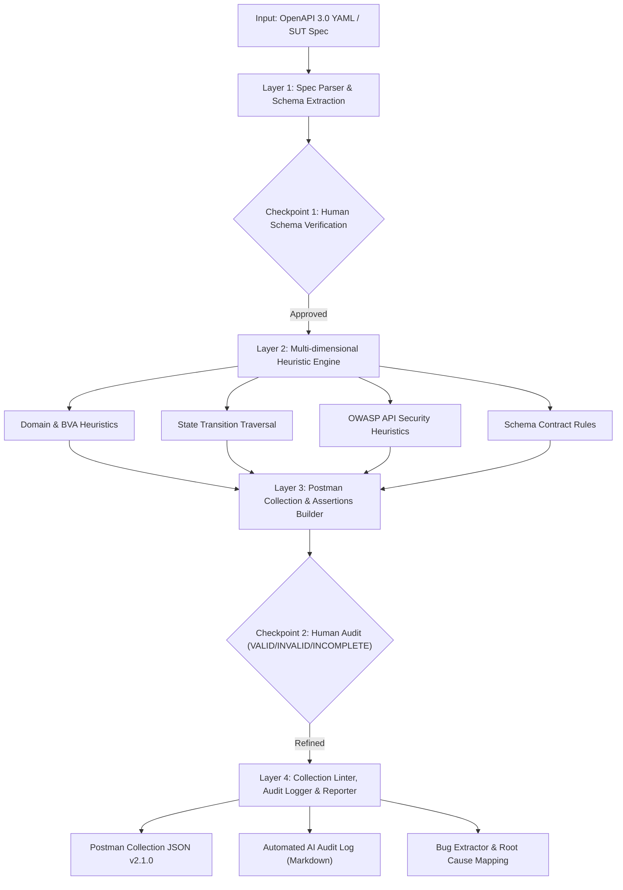

# Agent Skill: AI API Test Generator (G9.5 - Create)

**Tác giả:** Lâm Hữu Khánh (MSSV: `23127205`)  
**Môn học:** Software Testing (HCMUS) — HW06: API Testing  
**Mức năng lực:** Bloom-AI G9.5 (Create) kết hợp G9.4 (Collaborate với Human Review Checkpoints)  

---

## 1. Tổng Quan Về Skill

Skill này là một bộ sinh test tự động chuyên nghiệp (Automated API Test Generator) được xây dựng theo kiến trúc 4 tầng, cho phép Agent hoặc Kỹ sư QA:
1. Nhận đầu vào là đặc tả API (OpenAPI 3.0 YAML `docs/openapi.yaml` hoặc Markdown `api_specification.md`).
2. Tự động áp dụng Heuristic Strategy Engine để sinh ra hàng chục kịch bản kiểm thử bao phủ toàn diện: **Phân hoạch miền (Domain & BVA)**, **Chuyển trạng thái (State Transition)**, **Bảo mật (OWASP API Top 10: Broken Auth, SQLi, Data Exposure)** và **Kiểm tra Schema / Latency**.
3. Tự động đóng gói thành **Postman Collection v2.1.0 JSON** hoàn chỉnh kèm Pre-request Scripts chèn Header chống gian lận `X-Student-Id: 23127205` và Chai Test Assertions.
4. Tự động xuất **Báo cáo Kiểm toán AI (AI Audit Log Markdown)** và danh sách phân tích lỗi SUT.

---

## 2. Sơ Đồ Kiến Trúc 4 Tầng & Checkpoints Con Người




---

## 3. Cấu Trúc Các Tệp Tin Trong Thư Mục Agent Skill

- `generate_api_tests.py` / `skill.py`: Mã nguồn Python CLI thực thi toàn bộ pipeline 4 tầng.
- `diagram.png`: Sơ đồ kiến trúc 4 tầng tự thiết kế và kết xuất đồ họa.
- `pseudocode.md`: Giải thuật chi tiết và mô tả các Checkpoint của con người.
- `SKILL.md`: Tài liệu đặc tả Agent Skill và hướng dẫn tích hợp.
- `audit_log.md`: Nhật ký kiểm toán AI tự động xuất ra sau mỗi lần chạy.

---

## 4. Hướng Dẫn Sử Dụng CLI

### 4.1 Cài Đặt Thư Viện Phụ Thuộc
```bash
pip install pyyaml pillow matplotlib
```

### 4.2 Lệnh Thực Thi Cơ Bản
```bash
# Chạy sinh test suite từ đặc tả OpenAPI 3.0
python agent-skill/generate_api_tests.py \
  --spec docs/openapi.yaml \
  --student-id 23127205 \
  --output postman/generated_test_suite.json \
  --audit-out agent-skill/audit_log.md
```

### 4.3 Các Tham Số Tùy Chọn
- `--spec`: Đường dẫn file đặc tả đầu vào (`.yaml`, `.yml`, `.json`, `.md`). Mặc định: `docs/openapi.yaml`.
- `--student-id`: Mã số sinh viên để inject header chống gian lận `X-Student-Id`. Mặc định: `23127205`.
- `--base-url`: Biến URL gốc trong Postman collection. Mặc định: `{{base_url}}`.
- `--output`: Đường dẫn lưu file Postman collection JSON. Mặc định: `postman/generated_test_suite.json`.
- `--audit-out`: Đường dẫn lưu file Markdown AI Audit Log. Mặc định: `agent-skill/audit_log.md`.

---

## 5. Minh Họa Quy Trình Hoạt Động Của Skill (Demo Workflow)

1. **Khởi chạy Tool:**
   ```text
   [Layer 1] Parsing API Specification...
    -> Extracted 9 endpoints across 3 functional areas.
   [Layer 2] Running Multi-dimensional Heuristic Strategy Engine...
    -> Generated 37 test cases (Domain, Security, State Transition, Schema).
   [Layer 3] Building Postman Collection JSON...
    -> Successfully saved Postman Collection to: postman/generated_test_suite.json
   [Layer 4] Writing AI Audit Log & Quality Checkpoints...
    -> Successfully exported AI Audit Log to: agent-skill/audit_log.md
   [SUCCESS] Agent Skill pipeline execution completed successfully!
   ```
2. **Kiểm tra và Thực thi với Newman:**
   ```bash
   newman run postman/generated_test_suite.json -e postman/HW06_Local.postman_environment.json
   ```
