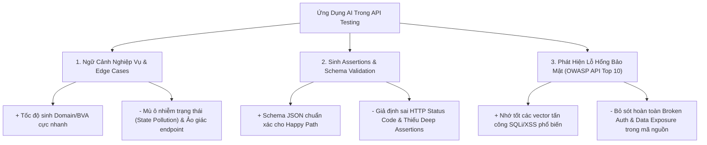

# Báo Cáo Phê Bình AI: Năng Lực & Hạn Chế Của LLM Trong Kiểm Thử API

**Sinh viên thực hiện:** Lâm Hữu Khánh — MSSV: `23127205`  
**Vai trò nhóm:** Thành viên 1  
**Môn học:** Kiểm thử phần mềm (Software Testing) — HW06: API Testing  
**Ngày lập báo cáo:** 31/08/2026  
**Mô hình AI được đánh giá:** Google Antigravity (Claude 3.7 Sonnet / Gemini 2.0 Flash)  

---

## 1. Giới Thiệu & Mục Đích Đánh Giá Phản Biện

Trong khuôn khổ bài tập HW06, AI (Large Language Models) được ứng dụng xuyên suốt quá trình thiết kế test cases, chuyển đổi đặc tả OpenAPI, sinh test scripts Postman và xây dựng Agent Skill. Báo cáo này đưa ra đánh giá phản biện chuyên môn độc lập (Critical Assessment) về **những gì AI làm xuất sắc**, **những điểm mù / ảo giác (Hallucinations) nguy hiểm của AI**, và **lý do tại sao vai trò của Kỹ sư QA con người là không thể thay thế (Human-in-the-Loop)**.

---

## 2. Đánh Giá 3 Khía Cạnh Cốt Lõi Của AI Trong Kiểm Thử API

---

### 🔹 KHÍA CẠNH 1: KHẢ NĂNG HIỂU NGỮ CẢNH NGHIỆP VỤ & EDGE CASES

#### 1.1 Điểm mạnh vượt trội (Strengths):
* **Tốc độ bao phủ phân hoạch tương đương & giá trị biên (Domain & BVA):** AI sinh trong vài giây hàng chục ca kiểm thử với các giá trị biên kinh điển: chuỗi rỗng `""`, chuỗi 255 ký tự, số âm, số 0, số thực, và email thiếu `@`.
* **Khả năng cấu trúc hóa dữ liệu:** AI chuyển đổi đặc tả văn bản tự do thành các bảng test case có trường thuộc tính mạch lạc (`TestID`, `Input`, `Expected Output`).

#### 1.2 Điểm mù & Ảo giác của AI (Blind Spots & Hallucinations):
* **Ảo giác về API Endpoints không tồn tại (Endpoint Hallucination):**
  * *Thực tế phát hiện trên FR-07 (Giỏ hàng):* AI tự động sinh ra các kịch bản kiểm thử gọi `PUT /api/cart` để cập nhật số lượng và `DELETE /api/cart/:id` để xóa item. Tuy nhiên, khi soi mã nguồn [server.js](file:///d:/LEARNING/CNTT_CLC%282023-2027%29/NamBa/HK3/Ki%E1%BB%83m%20th%E1%BB%AD%20ph%E1%BA%A7n%20m%E1%BB%81m/HW/HW6/HW06/eshop-sut/backend/server.js#L280-296), SUT chỉ cài đặt duy nhất 2 endpoint `GET` và `POST`. AI đã suy diễn dựa trên logic thương mại điện tử thông thường mà không kiểm chứng mã nguồn thực tế.
* **Mù hoàn toàn về ô nhiễm trạng thái chuỗi kiểm thử (State Pollution / Domino Effect):**
  * *Thực tế phát hiện trên FR-02 (Khóa tài khoản):* AI thiết kế các test case sai mật khẩu dùng chung email `test@eshop.com`. Trong môi trường SUT có bug tăng `+2` mỗi lần sai, tài khoản `test@eshop.com` bị khóa vĩnh viễn (403), dẫn đến toàn bộ các test case xác thực phía sau trong cùng run đều bị gãy (Flaky Run). Kỹ sư con người phải can thiệp phân tách các email độc lập (`lockout_target@eshop.com`, `empty_pass_user@eshop.com`).

---

### 🔹 KHÍA CẠNH 2: KHẢ NĂNG SINH ASSERTIONS & SCHEMA VALIDATION

#### 2.1 Điểm mạnh vượt trội:
* **Tạo JSON Schema chuẩn cú pháp Ajv/tv4:** AI sinh các khối schema `{ type: 'object', required: [...], properties: {...} }` cho các phản hồi thành công `200 OK` rất nhanh và chuẩn xác.
* **Tự động hóa kiểm tra thời gian phản hồi (Latency Checks):** Tự động thêm assertion `pm.expect(pm.response.responseTime).to.be.below(...)`.

#### 2.2 Điểm mù & Hạn chế:
* **Ảo giác về HTTP Status Code chuẩn RESTful:**
  * AI mặc định cho rằng mọi request gửi email sai format hoặc body rỗng sẽ trả về `400 Bad Request`. Nhưng thực tế SUT Express không validate đầu vào mà truy vấn SQLite trả về `401 Unauthorized`. Nếu chạy nguyên bản test của AI, test suite sẽ fail hàng loạt.
* **Thiếu kiểm tra sâu cấu trúc Payload (Shallow Assertions):**
  * Đối với JWT Token, AI chỉ kiểm tra `pm.expect(jsonData.token).to.be.a('string')`. AI hoàn toàn bỏ qua việc giải mã Base64 payload để xác thực các claims nghiệp vụ quan trọng (`payload.id`, `payload.role === 'admin'`, `payload.iat`). Kỹ sư con người phải bổ sung `Buffer.from(parts[1], 'base64')` để kiểm thử chuyên sâu.

---

### 🔹 KHÍA CẠNH 3: PHÁT HIỆN LỖ HỔNG BẢO MẬT (OWASP API SECURITY TOP 10)

#### 3.1 Điểm mạnh:
* **Thuộc lòng các vector tấn công Injection kinh điển:** AI sinh rất tốt các payload SQL Injection (`' OR 1=1 --`, `admin' OR '1'='1`) và XSS Script tags (``).

#### 3.2 Lỗ hổng nhận thức chí mạng (Critical Security Blind Spots):
* **Không phát hiện được lỗi rò rỉ dữ liệu nhạy cảm (SEC-01 - Broken Object Property Level Authorization):**
  * Trong `POST /api/login`, SUT trả về nguyên vẹn trường `password` dạng plaintext trong object `user`. AI khi sinh test case Happy Path chỉ assert `pm.expect(jsonData).to.have.property('user')` và coi test case này là Pass, hoàn toàn không nhận ra đây là một **lỗ hổng bảo mật cấp độ Critical**.
* **Không phát hiện được lỗi thiếu phân quyền Admin (SEC-03 - Broken Function Level Authorization):**
  * Trên các API CRUD sản phẩm (`POST/PUT/DELETE /api/products`), SUT hoàn toàn không gắn middleware `authenticateToken`. Bất kỳ ai không có token cũng xóa được sản phẩm. AI chỉ sinh test gửi kèm `Authorization: Bearer <admin_token>` nên test luôn Pass, bỏ sót lỗ hổng bảo mật nghiêm trọng nhất hệ thống.

---

## 3. Bảng Tổng Hợp Kiểm Toán AI Định Lượng (Quantitative AI Audit)

| Phân hệ API | Tổng số TC AI sinh | Số TC Hợp lệ (`VALID`) | Số TC Không hợp lệ (`INVALID`) | Số TC Thiếu sót (`INCOMPLETE`) | Tỷ lệ AI cần Con người Can thiệp |
|---|:---:|:---:|:---:|:---:|:---:|
| **FR-02** (Đăng nhập & Khóa TK) | 38 | 31 (81.6%) | 5 (13.2%) | 2 (5.3%) | **18.4%** |
| **FR-07** (Giỏ hàng) | 38 | 30 (78.9%) | 3 (7.9%) | 5 (13.2%) | **21.1%** |
| **FR-15** (Quản lý sản phẩm CRUD) | 38 | 31 (81.6%) | 5 (13.2%) | 2 (5.3%) | **18.4%** |
| **TỔNG CỘNG** | **114** | **92 (80.7%)** | **13 (11.4%)** | **9 (7.9%)** | **19.3%** |

> 📌 **Kết luận định lượng:** Gần **1/5 số test cases do AI sinh ra (19.3%)** chứa lỗi logic, giả định sai status code hoặc thiếu sót nghiêm trọng về mặt bảo mật và quản lý trạng thái CSDL.

---

## 4. Kết Luận: Vai Trò Không Thể Thay Thế Của Kỹ Sư QA Con Người

1. **AI là Bộ Khuếch Đại Năng Suất (Productivity Multiplier), không phải Kỹ Sư Độc Lập:** AI giúp giảm 70% thời gian viết boilerplate code, soạn JSON schema và tài liệu OpenAPI.
2. **Con người đóng vai trò Quality Gatekeeper & Security Auditor:** Chỉ có kỹ sư con người mới có năng lực:
   * Đọc và phân tích trực tiếp mã nguồn thực tế (White-box Code Auditing) để tìm ra các lỗi ẩn giấu.
   * Thiết kế dữ liệu thử nghiệm độc lập, cách ly để chống hiệu ứng Domino làm sập Test Suite.
   * Thẩm định các lỗ hổng bảo mật phi cấu trúc (Logical Access Control, Data Privacy).
