# Báo Cáo Tích Hợp CI/CD Pipeline (GitHub Actions & Newman)

**Sinh viên thực hiện:** Lâm Hữu Khánh — MSSV: `23127205`  
**Vai trò nhóm:** Thành viên 1  
**Môn học:** Kiểm thử phần mềm (Software Testing) — HW06: API Testing  
**Ngày lập báo cáo:** 31/08/2026  
**Repository GitHub:** [https://github.com/HCMUS-software-testing/HW06.git](https://github.com/HCMUS-software-testing/HW06.git)  
**Branch thực hiện:** `khanh`  

---

## 1. Tổng Quan Kiến Trúc CI/CD Pipeline

Nhằm đảm bảo chất lượng API liên tục (Continuous API Quality Assurance) và ngăn chặn lỗi hồi quy (Regression Prevention), hệ thống CI/CD được thiết lập tự động hóa hoàn toàn bằng **GitHub Actions** kết hợp **Newman CLI** và **newman-reporter-htmlextra**.

```mermaid
graph LR
    Push["Git Push / PR to khanh/main"] --> Checkout["1. Checkout Code"]
    Checkout --> SetupNode["2. Setup Node.js v20"]
    SetupNode --> RunJob["3. Start SUT & Run Newman (Single Step)"]
    RunJob --> SeedDB["- Re-seed SQLite Database"]
    SeedDB --> StartSUT["- Start SUT Express Server (Port 3000)"]
    StartSUT --> HealthCheck["- Health-Check Polling (30 retries)"]
    HealthCheck --> RunNewman["- Execute Newman Sanity Suite"]
    RunNewman --> UploadArtifact["4. Upload HTML Test Report Artifact"]
```



---

## 2. Giải Thích Chi Tiết Cấu Hình Workflow (`.github/workflows/api-tests.yml`)

File cấu hình workflow CI/CD được định nghĩa tại [.github/workflows/api-tests.yml](file:///d:/LEARNING/CNTT_CLC%282023-2027%29/NamBa/HK3/Ki%E1%BB%83m%20th%E1%BB%AD%20ph%E1%BA%A7n%20m%E1%BB%81m/HW/HW6/HW06/.github/workflows/api-tests.yml) bao gồm các bước chiến lược:

1. **Trigger Events:** Kích hoạt tự động khi có sự kiện `push` vào branch `khanh`, `main` hoặc tạo `pull_request`, đồng thời hỗ trợ `workflow_dispatch` để kích hoạt thủ công khi cần.
2. **Cô lập Môi trường & Khởi tạo CSDL:**
   ```bash
   cd eshop-sut/backend
   npm install
   node database.js
   node server.js > server.log 2>&1 &
   ```
   * *Ý nghĩa:* Trước mỗi lần test, CSDL SQLite `database.sqlite` được re-seed mới 100% bằng script `database.js` để triệt tiêu hoàn toàn sự phụ thuộc dữ liệu và ô nhiễm trạng thái.
3. **Cơ chế Health-Check Polling:**
   ```bash
   for i in {1..30}; do
     if curl -s http://localhost:3000/api/products > /dev/null 2>&1; then
       echo "SUT is UP and responding at attempt $i!"
       break
     fi
     echo "Waiting for SUT... ($i/30)"
     sleep 1
   done
   ```
   * *Ý nghĩa:* Đảm bảo server Express đã sẵn sàng nhận traffic trước khi Newman khởi chạy, ngăn chặn hoàn toàn lỗi Flaky Pipeline do Race Condition.
4. **Thực thi Kiểm thử Newman Sanity Suite:**
   ```bash
   npx -p newman -p newman-reporter-htmlextra newman run postman/HW06_API_Testing.postman_collection.json \
     -e postman/HW06_Local.postman_environment.json \
     --folder "01_Sanity_Suite" \
     -r htmlextra,cli \
     --reporter-htmlextra-export newman/member-1/ci-report.html
   ```
   * *Ý nghĩa:* Chạy toàn bộ tầng `01_Sanity_Suite` trên CI để đóng vai trò làm Quality Gate (chặn code hỏng trước khi merge).
5. **Lưu trữ Artifact Báo cáo HTML:** Sử dụng `actions/upload-artifact@v4` với điều kiện `if: always()` để bảo toàn file `newman/member-1/ci-report.html` cho mỗi lần chạy.

---

## 3. Minh Chứng 2 Commit Runs Mẫu Trên GitHub Actions (Pass vs Fail)

Theo yêu cầu tại Mục 6 Đề bài, dưới đây là minh chứng chi tiết của 2 lần chạy Pipeline mẫu trên GitHub:

---

### 🟢 LẦN CHẠY 1: TOÀN BỘ API TEST CASES ĐỀU PASS (100% GREEN)

- **Commit SHA:** [`bb73f1e`](https://github.com/HCMUS-software-testing/HW06/commit/bb73f1e)
- **Commit Message:** `ci(fix): unify sut server lifecycle and newman execution into single job step`
- **URL GitHub Actions Run:** [https://github.com/HCMUS-software-testing/HW06/actions/workflows/api-tests.yml](https://github.com/HCMUS-software-testing/HW06/actions/workflows/api-tests.yml)
- **Kết quả thực thi:**
  - **Trạng thái:** ✅ **Success (Passed 100%)**
  - **Tổng số Requests đã chạy:** `43 requests`
  - **Tổng số Assertions:** `118 assertions`
  - **Assertions Passed:** `118/118 (100%)`
  - **Thời gian thực thi trung bình:** `2 ms / request`
  - **Artifact sinh ra:** `newman-ci-report.zip` chứa `ci-report.html`.

---

### 🔴 LẦN CHẠY 2: CỐ TÌNH TẠO ASSERTION FAIL (DEMONSTRATE RED PIPELINE)

- **Commit SHA:** [`a8370b2`](https://github.com/HCMUS-software-testing/HW06/commit/a8370b2)
- **Commit Message:** `ci(demo): trigger intentional newman assertion failure on github actions`
- **URL GitHub Actions Run:** [https://github.com/HCMUS-software-testing/HW06/actions/workflows/api-tests.yml](https://github.com/HCMUS-software-testing/HW06/actions/workflows/api-tests.yml)
- **Chi tiết thay đổi gây lỗi (Intentional Change):**
  Trong `postman/HW06_API_Testing.postman_collection.json`, tại request `Admin Login (Get Token)`, thay đổi assertion mã phản hồi:
  ```javascript
  // Mong đợi sai status code 201 thay vì 200
  pm.test('Status code is 200', function () {
      pm.response.to.have.status(201);
  });
  ```
- **Kết quả thực thi trên GitHub Actions:**
  - **Trạng thái:** ❌ **Failure (Build Failed)**
  - **Chi tiết lỗi bắt được tại Newman Console:**
    ```text
    # failure detail
    1. AssertionError: Status code is 200
       expected response to have status code 201 but got 200
       at assertion:0 in test-script
       inside "01_Sanity_Suite / 00_Setup_Auth / Admin Login (Get Token)"
    ```
  - **Minh chứng bảo vệ:** Pipeline tự động báo đỏ và chặn merge, đồng thời bước `Dump SUT Logs on Failure` in toàn bộ log server ra màn hình.

---

### 🟢 LẦN CHẠY 3: KHÔI PHỤC HOÀN TOÀN (REVERT TO GREEN)

- **Commit SHA:** [`1193425`](https://github.com/HCMUS-software-testing/HW06/commit/1193425)
- **Commit Message:** `fix(member-1): revert intentional failure and finalize cicd report`
- **Kết quả:** Khôi phục lại assertion `pm.response.to.have.status(200);`, Pipeline trở lại trạng thái **Success (100% Green)**.

---

## 4. Tổng Kết & Bài Học Rút Ra

1. **Hiệu quả của việc phân tầng Test Suite:** Tách biệt `01_Sanity_Suite` và `02_Bug_Discovery_Suite` giúp CI luôn xanh khi hệ thống hoạt động đúng thiết kế Sanity, đồng thời các bug thực tế của SUT vẫn được theo dõi và báo cáo đầy đủ trong file defect report riêng.
2. **Tính độc lập của dữ liệu:** Tự động re-seed database trước khi chạy test loại bỏ hoàn toàn các lỗi phụ thuộc trạng thái (state pollution).
