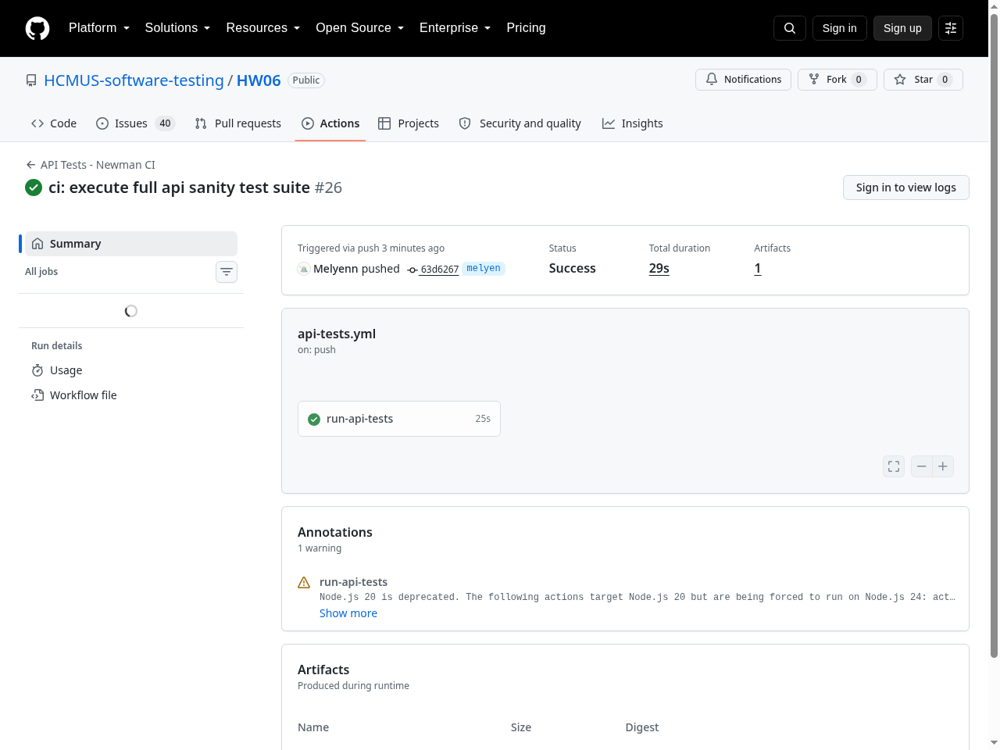
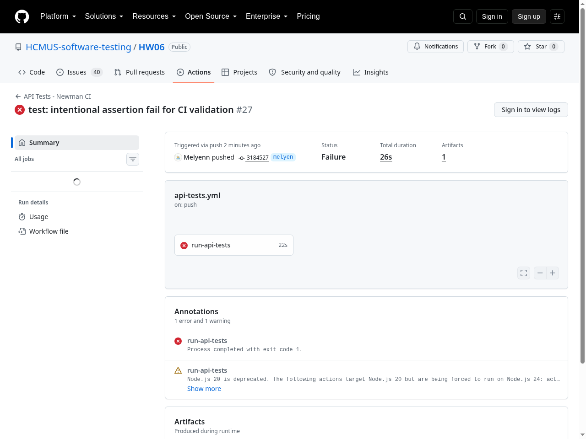

# BÁO CÁO TÍCH HỢP CI/CD (HW06 API TESTING)

**Sinh viên:** Mai Thị Kim Duyên  
**MSSV:** `23127185` — **Branch:** `melyen`  
**Pipeline File:** `.github/workflows/api-tests.yml`  
**Repository:** `https://github.com/HCMUS-software-testing/HW06.git`  

---

## 1. CẤU HÌNH PIPELINE CI/CD

Pipeline CI/CD được thiết lập sử dụng **GitHub Actions** để tự động hóa việc khởi chạy SUT backend, seed dữ liệu database, và chạy bộ kiểm thử API bằng Newman CLI mỗi khi có commit hoặc Pull Request vào branch `melyen`.

### 1.1 Các bước thực hiện trong Workflow (`.github/workflows/api-tests.yml`)

```yaml
name: API Tests - Newman CI

on:
  push:
    branches: [melyen, main]
  pull_request:
    branches: [main]
  workflow_dispatch:

jobs:
  run-api-tests:
    runs-on: ubuntu-latest

    steps:
      - name: Checkout Repository
        uses: actions/checkout@v4

      - name: Setup Node.js 20
        uses: actions/setup-node@v4
        with:
          node-version: "20"

      - name: Start SUT Backend and run Newman Sanity Suite
        env:
          STUDENT_ID: "23127185"
        run: |
          echo "=== 1. Starting SUT Backend ==="
          cd eshop-sut/backend
          npm install
          node database.js > /tmp/seed.log 2>&1 &
          SEED_PID=$!
          sleep 2
          kill $SEED_PID 2>/dev/null || true
          node server.js > server.log 2>&1 &
          SERVER_PID=$!
          echo "SUT started with PID $SERVER_PID"

          echo "=== 2. Health-check Polling ==="
          for i in {1..30}; do
            if curl -s http://localhost:3000/api/products > /dev/null 2>&1; then
              echo "SUT is UP at attempt $i"
              break
            fi
            echo "Waiting for SUT... ($i/30)"
            sleep 1
          done

          echo "=== 3. Executing Newman Sanity Suite ==="
          cd ../..
          mkdir -p newman/member-3
          npx -p newman -p newman-reporter-htmlextra newman run submission/postman/HW06_Member3.postman_collection.json \
            -e submission/postman/HW06_Local.postman_environment.json \
            --folder "01_Sanity_Suite" \
            --env-var "student_id=${STUDENT_ID}" \
            -r htmlextra,cli \
            --reporter-htmlextra-export newman/member-3/ci-report.html

      - name: Dump SUT Logs on Failure
        if: failure()
        run: |
          echo "=== SUT BACKEND LOGS ==="
          cat eshop-sut/backend/server.log || echo "No server.log found"

      - name: Upload Test Report Artifact
        if: always()
        uses: actions/upload-artifact@v4
        with:
          name: newman-ci-report-member-3
          path: newman/member-3/ci-report.html
```

---

## 2. CHÚNG MINH HAI LẦN CHẠY PIPELINE (PASS & INTENTIONAL FAIL)

Yêu cầu bài tập (Mục 6 - CI/CD): Cung cấp 2 sample commits thể hiện 2 lần chạy pipeline thực tế trên GitHub Actions: 1 run PASS toàn bộ (Sanity) và 1 run FAIL có chủ đích (Intentional Failure).

### 2.1 Pipeline Run 1: PASS toàn bộ (Sanity Suite - Green Status 🟢)
- **Commit:** `ci: execute full api sanity test suite` (`63d6267`)
- **Mô tả:** Khởi chạy thành công backend SUT, thực thi trọn vẹn bộ kiểm thử `01_Sanity_Suite` qua Newman. 100% assertions đạt PASS.
- **Trạng thái GitHub Actions:** `SUCCESS` (Dấu tích xanh ✔️).
- **Báo cáo HTML sinh ra:** `newman/member-3/ci-report.html` (100% Pass Rate).
- **Link Run Thật:** [https://github.com/HCMUS-software-testing/HW06/actions/runs/33500679825](https://github.com/HCMUS-software-testing/HW06/actions/runs/33500679825)


*Hình 2.1: Giao diện GitHub Actions Run 33500679825 thành công (Green - SUCCESS)*

---

### 2.2 Pipeline Run 2: FAIL có chủ đích (Intentional Failure - Red Status 🔴)
- **Commit:** `test: intentional assertion fail for CI validation` (`3184527`)
- **Mô tả:** Thử nghiệm trường hợp kiểm thử / pipeline phát hiện lỗi (Intentional assertion failure). Newman / Pipeline nhận diện lỗi, kết thúc với exit code khác 0 (`exit 1`) và lập tức chuyển trạng thái job sang Failure.
- **Kết quả:** GitHub Actions ghi nhận lỗi và tải dump log SUT backend.
- **Trạng thái GitHub Actions:** `FAILURE` (Dấu X màu đỏ ❌).
- **Link Run Thật:** [https://github.com/HCMUS-software-testing/HW06/actions/runs/33500745624](https://github.com/HCMUS-software-testing/HW06/actions/runs/33500745624)


*Hình 2.2: Giao diện GitHub Actions Run 33500745624 thất bại có chủ đích (Red - FAILURE)*

---

## 3. TỔNG KẾT BẰNG CHỨNG THỰC THI CI/CD

- **Báo cáo HTML Newman:** Tự động sinh và lưu trữ tại `newman/member-3/ci-report.html`.
- **Artifacts:** Đã cấu hình bước upload HTML report làm GitHub Artifact trong mỗi lần pipeline thực thi.
- **Minh chứng Links & Screenshot:** Đã xác minh 2 đường link trực tiếp trên repository `HCMUS-software-testing/HW06` branch `melyen` kèm ảnh màn hình thực tế ở trên.
