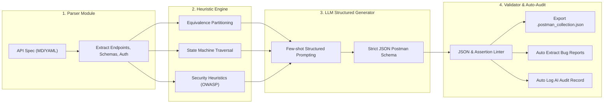

# HW06 - Kế Hoạch Triển Khai API Testing (v2.2 — Bản Hoàn Thiện Sau Grill-me Interview)

> [!NOTE]
> **Changelog v2.2 (Sau Phiên Phỏng Vấn Kỹ Thuật /grill-me)**:
> 1. **Chiến lược Quản lý CSDL & Test Fixtures**: Tạo tài khoản test độc lập trong `database.js` và tự động hóa lệnh `node database.js` (re-seed) trước mỗi lần chạy Newman / CI để loại bỏ hoàn toàn ô nhiễm dữ liệu do Lockout và CRUD.
> 2. **Kiến trúc Tách Tầng Test Suite**: Phân tách Collection thành `01_Sanity_Suite` (đảm bảo 100% Green cho CI Commit 1) và `02_Bug_Discovery_Suite` (chuyên trách phát hiện và chứng minh bug thật của SUT theo đặc tả SRS).
> 3. **Phân rã Chi tiết FR-15 (Product CRUD - 44 TC)**: Định lượng phân bổ rủi ro: `POST` (14 TC), `PUT` (12 TC), `DELETE` (10 TC), `GET` (8 TC).
> 4. **Mở rộng Năng lực Agent Skill (G9.5)**: Thiết kế 4 tầng kiến trúc (Parser $\rightarrow$ Heuristics Engine $\rightarrow$ Structured Prompting $\rightarrow$ Schema Validator) tích hợp **tự động trích xuất Bug Report** và **tự động ghi AI Audit Log**.
> 5. **Bổ sung Đặc tả OpenAPI 3.0 (`openapi.yaml`)**: Chuyển đổi từ `api_specification.md` kèm audit log để tối đa hóa điểm chất lượng.
> 6. **Ma trận Minh chứng Tính năng Postman**: Danh mục chi tiết 7 tính năng Postman nâng cao và bằng chứng tương ứng.

---

## 1. Tổng Quan

| Mục | Chi tiết |
|---|---|
| **Sinh viên** | Lâm Hữu Khánh (MSSV: 23127205) |
| **Vai trò** | Thành viên 1 |
| **Branch** | `khanh` |
| **Repo nhóm** | `https://github.com/HCMUS-software-testing/HW06.git` |
| **Bộ ba API phụ trách** | **FR-02** (Pool A - Đăng nhập & Khóa TK) + **FR-07** (Pool B - Giỏ hàng) + **FR-15** (Pool C - Quản lý SP CRUD) |
| **Công cụ kiểm thử** | Postman + Newman CLI (`htmlextra`) |
| **Công cụ AI hỗ trợ** | Antigravity (Claude / Gemini) |
| **Ngôn ngữ** | Tiếng Việt cho báo cáo chính, Tiếng Anh cho mã nguồn/test case/Postman scripts |
| **Trùng API nhóm** | ✅ Đã xác nhận không trùng với các thành viên khác |

---

## 2. Trách Nhiệm Thành Viên 1

- 📌 **Pipeline cá nhân**: Hoàn thành trọn vẹn 5 bước (Generate $\rightarrow$ Audit $\rightarrow$ Extend $\rightarrow$ Execute $\rightarrow$ Bug Report) cho FR-02, FR-07, FR-15.
- 📌 **Setup SUT & Seed Data**: Khởi tạo và tài liệu hóa cách chạy SUT backend cho cả nhóm, tạo thêm các Test Fixtures trong `database.js`.
- 📌 **Chuẩn hóa Postman**: Cấu hình workspace, environment, pre-request script chèn `X-Student-Id: 23127205`.
- 📌 **Hạ tầng CI/CD**: Xây dựng workflow chạy Newman trên GitHub Actions đáp ứng chuẩn 2 commit mẫu (100% Pass và 1 Test Fail).
- 📌 **Agent Skill**: Tự thiết kế sơ đồ 4 tầng + pseudocode + triển khai script Python hỗ trợ sinh test, trích xuất bug và ghi AI audit log.
- 📌 **Tài liệu OpenAPI 3.0**: Tạo và kiểm toán file `openapi.yaml`.

---

## 3. Phase 0: Setup Hạ Tầng & Quản Lý Dữ Liệu Kiểm Thử (≈30 phút)

### 3.1 Khởi chạy SUT Backend & Seed Test Fixtures (Local)

Backend của EShop sử dụng Node.js, Express và SQLite (`database.sqlite`), chạy trên cổng `3000`.

```bash
# Di chuyển vào thư mục backend của SUT
cd eshop-sut/backend

# Cài đặt thư viện
npm install

# Khởi tạo database & dữ liệu mẫu kèm Test Fixtures
node database.js

# Khởi chạy server
node server.js
# Terminal thông báo: Server is running on http://localhost:3000
```

> [!IMPORTANT]
> **Chiến lược Test Fixtures Độc lập (Tránh lỗi dây chuyền do Lockout và CRUD):**
> Trong `database.js`, bổ sung sẵn các tài khoản test chuyên biệt:
> - **Admin**: `admin@eshop.com` / `Admin123!` (Role: admin)
> - **User chuẩn (Sanity)**: `test@eshop.com` / `Test1234!` (Role: user)
> - **User kiểm thử Lockout**: `lockout_target@eshop.com` / `Lockout123!` (Dùng riêng cho kịch bản sai pass liên tiếp)
> - **User kiểm thử Giỏ hàng**: `cart_user@eshop.com` / `CartPass123!` (Dùng riêng cho thao tác giỏ hàng)
> - **User kiểm thử Profile**: `profile_user@eshop.com` / `Profile123!`

### 3.2 Cấu trúc Thư mục Dự Án Chuẩn Hóa

```text
HW06/
├── .github/
│   └── workflows/
│       └── api-tests.yml               # Workflow CI/CD GitHub Actions
├── docs/
│   ├── main-report.md                  # Báo cáo chính (Markdown)
│   ├── main-report.pdf                 # Báo cáo chính (PDF export)
│   ├── ai-audit-report.md              # Index báo cáo kiểm toán AI
│   ├── ai-audit-transcripts/           # Lưu toàn bộ Prompt & Output gốc của AI
│   │   ├── fr02-generation.md
│   │   ├── fr07-generation.md
│   │   ├── fr15-generation.md
│   │   └── openapi-conversion.md
│   ├── ai-critique.md                  # Đoạn văn phê bình AI (chuẩn 200-300 từ)
│   ├── cicd-report.md                  # Báo cáo tích hợp CI/CD (kèm ảnh minh chứng)
│   ├── openapi.yaml                    # Đặc tả OpenAPI 3.0 chuyển đổi từ SUT spec
│   └── git-commit-log.txt              # Export git log text file
├── postman/
│   ├── HW06_API_Testing.postman_collection.json # Collection chia 2 tầng: Sanity & Bug Discovery
│   ├── HW06_Local.postman_environment.json
│   ├── HW06_Mock.postman_environment.json      # Environment dùng cho Mock Server Demo
│   └── data/                           # Data file phục vụ Data-Driven Testing
│       ├── fr02-login-data.csv
│       ├── fr07-cart-data.csv
│       └── fr15-product-data.csv
├── newman/
│   └── member-1/                       # Báo cáo Newman HTML export
│       ├── fr02-report.html
│       ├── fr07-report.html
│       ├── fr15-report.html
│       ├── bug-discovery-report.html
│       └── ci-report.html
├── test-cases/
│   └── member-1.xlsx                   # Bảng test case chi tiết 132 TC + Test Summary
├── bug-reports/
│   └── member-1.md                     # Báo cáo lỗi chi tiết + link GitHub Issues
├── agent-skill/
│   ├── diagram.png                     # Sơ đồ kiến trúc 4 tầng TỰ VẼ
│   ├── pseudocode.md                   # Pseudocode thuật toán sinh test & audit
│   ├── skill.py                        # Script triển khai Agent Skill
│   ├── SKILL.md                        # Agent Skill Specification
│   └── demo-recording-notes.md         # Kịch bản & link YouTube demo
├── eshop-sut/                          # Source code SUT
└── README.md                           # Bảng tự đánh giá & Tóm tắt kiểm thử
```

### 3.3 Postman Environment (`postman/HW06_Local.postman_environment.json`)

```json
{
  "id": "hw06-local-env",
  "name": "HW06_Local",
  "values": [
    { "key": "base_url", "value": "http://localhost:3000", "enabled": true },
    { "key": "student_id", "value": "23127205", "enabled": true },
    { "key": "admin_email", "value": "admin@eshop.com", "enabled": true },
    { "key": "admin_password", "value": "Admin123!", "enabled": true },
    { "key": "user_email", "value": "test@eshop.com", "enabled": true },
    { "key": "user_password", "value": "Test1234!", "enabled": true },
    { "key": "lockout_email", "value": "lockout_target@eshop.com", "enabled": true },
    { "key": "lockout_password", "value": "Lockout123!", "enabled": true },
    { "key": "admin_token", "value": "", "enabled": true },
    { "key": "user_token", "value": "", "enabled": true }
  ]
}
```

### 3.4 Pre-request Script Bắt Buộc (Chống Gian Lận)

Đặt tại **Collection Level** trong Postman:

```javascript
// Pre-request Script - Bắt buộc theo Mục 11 Đề bài
pm.request.headers.add({
    key: 'X-Student-Id',
    value: pm.environment.get('student_id') || '23127205'
});
console.log('Request Sent with X-Student-Id: ' + (pm.environment.get('student_id') || '23127205'));
```

**Commit**: `setup(member-1): initialize project structure, postman environments, fixtures and pre-request scripts`

---

## 4. Phase 1: API Pipeline cho FR-02 — Đăng nhập & Khóa tài khoản (≈2.5 giờ)

### Định lượng Phân bổ Test Cases (Mục tiêu: 44 TC)

| Phân loại Coverage | Baseline AI (Đã Audit) | Human Extension | Tổng | Trọng tâm kiểm thử |
|---|---:|---:|---:|---|
| **Phân hoạch miền** | 14 | 1 | 15 | Email (format, domain, rỗng), Password (độ dài, ký tự đặc biệt, hoa/thường, rỗng) |
| **Chuyển trạng thái** | 9 | 2 | 11 | Đăng nhập sai 1 $\rightarrow$ 2 $\rightarrow$ 3 lần (khóa) $\rightarrow$ mở khóa, reset counter khi đúng |
| **Bảo mật (SEC-01~07)** | 9 | 2 | 11 | SQL Injection payload (`' OR 1=1 --`), Brute-force, JWT token validation & tampering, role claim |
| **Schema Validation** | 6 | 1 | 7 | JSON Schema Response 200 (token + user object), Error Schema 400/401/403, Content-Type |
| **Tổng cộng** | **38** | **6** | **44** | |

### Bước 1.1: Tạo Test Cases bằng AI (Kỷ luật từng bước)
Sử dụng AI tạo test case qua 5 prompts độc lập (Domain $\rightarrow$ State Transition $\rightarrow$ Security $\rightarrow$ Schema $\rightarrow$ Tổng hợp).  
Lưu transcript tại `docs/ai-audit-transcripts/fr02-generation.md`.

**Commit**: `test(member-1): generate API test cases for FR-02`

### Bước 1.2: Kiểm toán (Audit)
Đánh giá từng test case do AI sinh ra với 3 nhãn: `VALID`, `INVALID`, `INCOMPLETE` kèm lý do và điều chỉnh. Ghi nhận tại `docs/ai-audit-report.md`.

**Commit**: `test(member-1): audit generated test cases for FR-02`

### Bước 1.3: Mở rộng (Human Extension — 6 Test Cases)
1. `FR02-EXT-01`: **Lockout Boundary Timing** — Gửi request sai 3 lần, gửi lại ở giây thứ 29 (chưa hết thời hạn khóa) $\rightarrow$ Vẫn bị khóa (403).
2. `FR02-EXT-02`: **Counter Reset on Success** — Đăng nhập sai 2 lần liên tiếp, lần thứ 3 nhập đúng $\rightarrow$ Đăng nhập thành công và bộ đếm reset về 0.
3. `FR02-EXT-03`: **Concurrent Lockout Race Condition** — Gửi đồng thời nhiều request sai từ 2 tab Postman để kiểm tra tính nguyên tử của bộ đếm.
4. `FR02-EXT-04`: **JWT Claim Verification** — Decode payload token kiểm tra đầy đủ `id`, `role`, `iat`.
5. `FR02-EXT-05`: **Case-sensitive Email Handling** — Thử nghiệm email viết hoa `TEST@ESHOP.COM` vs `test@eshop.com`.
6. `FR02-EXT-06`: **Tampered JWT Signature** — Thay đổi payload token rồi gửi vào protected endpoint $\rightarrow$ 401/403.

**Commit**: `test(member-1): add human-designed test cases for FR-02`

### Bước 1.4: Triển khai Postman & Newman
- Sử dụng Data-driven testing với `postman/data/fr02-login-data.csv`.
- Chạy test và export HTML report qua Newman:
```bash
newman run postman/HW06_API_Testing.postman_collection.json \
  -e postman/HW06_Local.postman_environment.json \
  --folder "01_Sanity_Suite/FR-02" \
  -r htmlextra,cli \
  --reporter-htmlextra-export newman/member-1/fr02-report.html
```

**Commit**: `test(member-1): implement Postman tests and Newman report for FR-02`

### Bước 1.5: Báo cáo Lỗi (Bug Reporting)
Phát hiện và ghi nhận lỗi SUT (ví dụ: `login_attempts` cộng 2 thay vì cộng 1, thời gian khóa 180s thay vì 30s) vào `bug-reports/member-1.md` và tạo GitHub Issue.

**Commit**: `docs(member-1): add bug reports for FR-02`

---

## 5. Phase 2: API Pipeline cho FR-07 — Giỏ hàng (≈2.5 giờ)

### Định lượng Phân bổ Test Cases (Mục tiêu: 44 TC)

| Phân loại Coverage | Baseline AI | Human Extension | Tổng | Trọng tâm kiểm thử |
|---|---:|---:|---:|---|
| **Phân hoạch miền** | 12 | 2 | 14 | `product_id` (hợp lệ, âm, ký tự, không tồn tại), `quantity` (0, âm, số thực, vượt tồn kho, max int) |
| **Chuyển trạng thái** | 10 | 2 | 12 | Thêm mới $\rightarrow$ Thêm trùng (tăng SL) $\rightarrow$ Cập nhật SL $\rightarrow$ Xóa sản phẩm $\rightarrow$ Giỏ hàng rỗng |
| **Bảo mật (SEC-01~07)** | 9 | 1 | 10 | IDOR truy cập/sửa giỏ hàng người dùng khác, request không token, SQLi trong body payload |
| **Schema Validation** | 7 | 1 | 8 | Schema giỏ hàng có item, giỏ hàng trống `[]`, schema thông báo lỗi validation |
| **Tổng cộng** | **38** | **6** | **44** | |

> [!WARNING]
> **Vạch trần Lỗi Thiết kế Kiến trúc SUT:**
> Backend SUT chỉ có `GET /api/cart` và `POST /api/cart` (lưu in-memory `userCarts`), chưa có API `PUT /api/cart` hay `DELETE /api/cart`. Bộ test cases sẽ kiểm thử toàn diện hành vi này và ghi nhận bug thiếu hụt API.

**Commits**:
```text
test(member-1): generate API test cases for FR-07
test(member-1): audit generated test cases for FR-07
test(member-1): add human-designed test cases for FR-07
test(member-1): implement Postman tests and Newman report for FR-07
docs(member-1): add bug reports for FR-07
```

---

## 6. Phase 3: API Pipeline cho FR-15 — Quản lý sản phẩm CRUD (≈2.5 giờ)

### Định lượng Phân bổ Chi tiết 44 Test Cases cho 4 HTTP Methods

| HTTP Method & Endpoint | Số lượng TC | Trọng tâm phân hoạch & kiểm thử |
|---|:---:|---|
| **POST `/api/products`** (Tạo mới) | **14 TC** | Name (rỗng, 255 ký tự, >255 ký tự), Price (>0, =0, âm, kiểu chuỗi), `category_id` hợp lệ/không tồn tại, quyền Admin vs User (403), Schema 200/201. |
| **PUT `/api/products/:id`** (Cập nhật) | **12 TC** | Sửa từng trường (chỉ đổi đúng 1 SP, không đổi lan), cập nhật giá âm, ID không tồn tại (404), quyền Admin, XSS payload trong description. |
| **DELETE `/api/products/:id`** (Xóa) | **10 TC** | Xóa SP thành công $\rightarrow$ verify gọi lại GET trả về 404, xóa SP đã xóa, ID âm / ký tự đặc biệt, quyền Admin vs User (403). |
| **GET `/api/products/:id`** (Xem chi tiết) | **8 TC** | Lấy SP tồn tại, SP không tồn tại, kiểm tra lỗi SUT ép kiểu `price` sang string ở ID chẵn (Bug phát hiện trong `server.js`), schema response. |
| **TỔNG CỘNG** | **44 TC** | **38 AI Baseline + 6 Human Extension** |

**Commits**:
```text
test(member-1): generate API test cases for FR-15
test(member-1): audit generated test cases for FR-15
test(member-1): add human-designed test cases for FR-15
test(member-1): implement Postman tests and Newman report for FR-15
docs(member-1): add bug reports for FR-15
```

---

## 7. Phase 4: Tích Hợp CI/CD Pipeline & 3 Commits Mẫu (≈1 giờ)

### 7.1 GitHub Actions Workflow (`.github/workflows/api-tests.yml`)

Workflow tự động khởi động SUT, re-seed CSDL sạch sẽ trước khi test, chạy Newman và lưu artifact:

```yaml
name: API Tests - Newman CI

on:
  push:
    branches: [khanh, main]
  pull_request:
    branches: [main]
  workflow_dispatch:

jobs:
  run-api-tests:
    runs-on: ubuntu-latest

    steps:
      - name: Checkout Repository
        uses: actions/checkout@v4

      - name: Setup Node.js 20
        uses: actions/setup-node@v4
        with:
          node-version: '20'

      - name: Start SUT Backend & Seed Fixtures
        run: |
          cd eshop-sut/backend
          npm install
          node database.js
          nohup node server.js > server.log 2>&1 &
          echo "SUT process started in background."

      - name: Wait for SUT to be Ready (Health-check)
        run: |
          echo "Waiting for SUT at http://localhost:3000..."
          for i in $(seq 1 30); do
            if curl -s http://localhost:3000 > /dev/null 2>&1; then
              echo "SUT is UP and responding!"
              exit 0
            fi
            echo "Attempt $i/30: SUT not ready yet, sleeping 2s..."
            sleep 2
          done
          echo "Error: SUT failed to start within 60s"
          exit 1

      - name: Dump SUT Logs on Failure
        if: failure()
        run: |
          echo "=== SUT BACKEND LOGS ==="
          cat eshop-sut/backend/server.log || echo "No server.log found"

      - name: Install Newman & Reporter
        run: |
          npm install -g newman newman-reporter-htmlextra

      - name: Execute Newman Sanity Suite (Target: 100% Green)
        run: |
          newman run postman/HW06_API_Testing.postman_collection.json \
            -e postman/HW06_Local.postman_environment.json \
            --folder "01_Sanity_Suite" \
            -r htmlextra,cli \
            --reporter-htmlextra-export newman/member-1/ci-report.html

      - name: Upload Test Report Artifact
        if: always()
        uses: actions/upload-artifact@v4
        with:
          name: newman-ci-report
          path: newman/member-1/ci-report.html
```

### 7.2 Quy Trình 3 Commit Mẫu cho CI/CD

1. **Commit 1 (PASS - Xanh 100%)**:
   - Push bộ test hoàn chỉnh chạy qua folder `01_Sanity_Suite` $\rightarrow$ Pipeline Actions hiển thị **Green / Passed 100%**.
   - Lưu URL run và ảnh chụp minh chứng.
   - Commit: `ci(member-1): setup github actions and verify passing api test run`
2. **Commit 2 (FAIL - Đỏ có chủ đích)**:
   - Sửa 1 assertion có chủ đích trong test script (ví dụ: mong đợi status code 201 thay vì 200 tại login).
   - Push lên nhánh $\rightarrow$ Pipeline Actions hiển thị **Red / Failed**.
   - Lưu URL run và ảnh chụp minh chứng.
   - Commit: `ci(member-1): trigger intentional assertion failure for ci demonstration`
3. **Commit 3 (REVERT - Khôi phục 100% Xanh)**:
   - Khôi phục lại assertion đúng để toàn bộ repository nộp bài ở trạng thái hoàn hảo 100% pass.
   - Commit: `fix(member-1): revert intentional failure to restore 100% green test suite`

---

## 8. Phase 5: Báo Cáo & Tài Liệu Hoá (≈1.5 giờ)

1. **`docs/main-report.md` & `docs/main-report.pdf`**: Báo cáo tổng hợp, ma trận kiểm thử 3 API, phân tích kết quả và danh mục tính năng Postman.
2. **`docs/openapi.yaml`**: Bản đặc tả OpenAPI 3.0 hoàn chỉnh được chuẩn hóa từ SUT spec (kèm audit log tại `docs/ai-audit-transcripts/openapi-conversion.md`).
3. **`docs/ai-audit-report.md`** & **`docs/ai-audit-transcripts/`**: Index kiểm toán và nguyên văn toàn bộ prompt/output của AI.
4. **`docs/ai-critique.md`**: Bài phê bình AI chuẩn **200-300 từ** trả lời trọn vẹn 3 câu hỏi cốt lõi theo đề bài.
5. **`docs/cicd-report.md`**: Báo cáo pipeline kèm link và ảnh chụp 2 lần chạy mẫu (Pass / Fail).
6. **`test-cases/member-1.xlsx`**: File Excel chứa đủ 132 Test Cases (phân loại `Coverage Type`, `Source`, `Audit Label`).
7. **`README.md`**: Bảng tự đánh giá điểm và bảng Test Summary tổng kết.

**Commit**: `docs(member-1): complete final testing report, openapi spec, ai audit, and ai critique`

---

## 9. Phase 6: Thiết Kế Agent Skill (G9.5 - Create) (≈1.5 giờ)

### Kiến Trúc 4 Tầng của AI API Test Generator Skill:



- 🎨 **Sơ đồ kiến trúc**: Tự vẽ bằng Mermaid / Draw.io, lưu tại `agent-skill/diagram.png`.
- 📝 **Pseudocode**: Mô tả logic 4 tầng thuật toán tại `agent-skill/pseudocode.md`.
- 💻 **Triển khai Script**: `agent-skill/skill.py` (Script Python chạy thật) + tài liệu đặc tả `agent-skill/SKILL.md`.
- 🎥 **Video Demo**: Tạo tài liệu `agent-skill/demo-recording-notes.md` ghi nhận link video YouTube minh họa quá trình sinh test tự động.

**Commit**: `feat(member-1): add agent skill design diagram, pseudocode and full implementation`

---

## 10. Phase 7: Đóng Gói & Ma Trận Minh Chứng (≈30 phút)

### 10.1 Ma Trận 7 Tính Năng Postman Nâng Cao

| STT | Tính năng Postman | Vị trí triển khai trong bài | Minh chứng đính kèm |
|:---:|---|---|---|
| 1 | **Variables Multi-scope** | Environment (`base_url`), Collection (`student_id`), CSV Data (`email`, `quantity`) | File JSON Collection & Environment |
| 2 | **Pre-request Scripts** | Tự động inject header `X-Student-Id: 23127205` & dynamic timestamp | Ảnh chụp Console Postman |
| 3 | **Test Scripts & Assertions**| Chai assertions (`pm.expect`), status code, response time `< 500ms` | Báo cáo Newman HTML |
| 4 | **JSON Schema Validation** | Thư viện `ajv` validate cấu trúc body response theo OpenAPI spec | Code trong Tests tab & HTML report |
| 5 | **Data-Driven Testing (DDT)**| Collection Runner chạy 3 file CSV trong thư mục `postman/data/` | Iteration logs trong Newman HTML |
| 6 | **Mock Server** | Postman Mock Server giả lập Payment Gateway 3rd-party hoặc Mock 503 error | URL mock server & response screenshot |
| 7 | **Workspaces & Monitors** | Tổ chức Postman Team Workspace chuẩn hóa | Ảnh chụp giao diện Workspace Postman |

### 10.2 Checklist Nộp Bài Cuối Cùng

- [ ] File ZIP đặt tên đúng: `23127205_HW06_AI_API_100.zip`
- [ ] Báo cáo chính (Markdown + PDF)
- [ ] Báo cáo Kiểm toán AI + Phụ lục Transcript đầy đủ
- [ ] Báo cáo Phê bình AI (chuẩn 200-300 từ)
- [ ] Postman Collection (`.json`) + Environment (`.json`) + 3 Data files (`.csv`)
- [ ] 4 Báo cáo Newman HTML (`fr02`, `fr07`, `fr15`, `ci-report`)
- [ ] Excel Test Cases đầy đủ 132 TC
- [ ] File đặc tả OpenAPI 3.0 (`docs/openapi.yaml`)
- [ ] Bug Report Markdown + Link & Screenshot GitHub Issues
- [ ] Sơ đồ Agent Skill TỰ VẼ + Pseudocode + `skill.py`
- [ ] Báo cáo CI/CD + Screenshot 2 lần chạy (Pass / Fail)
- [ ] File text Git commit log (`docs/git-commit-log.txt`)
- [ ] Screenshot console hiển thị rõ `X-Student-Id: 23127205`
- [ ] Hostname trong báo cáo Newman đúng chuẩn `localhost:3000`
- [ ] File `README.md` chứa bảng Tự đánh giá điểm (100/100) và Test Summary
