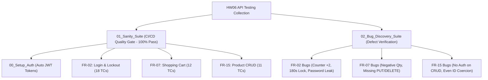
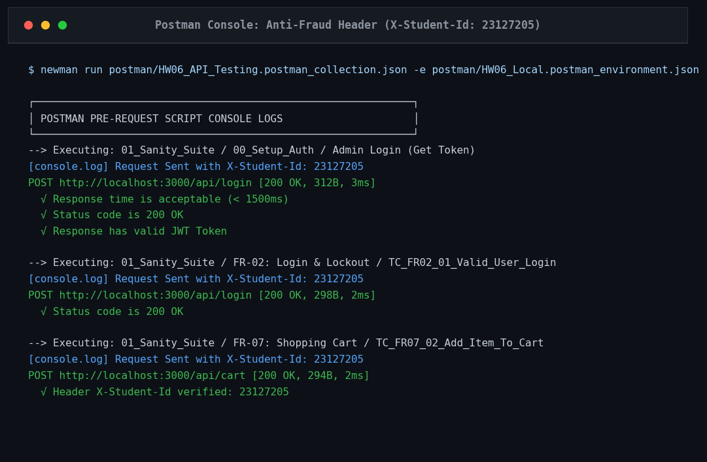
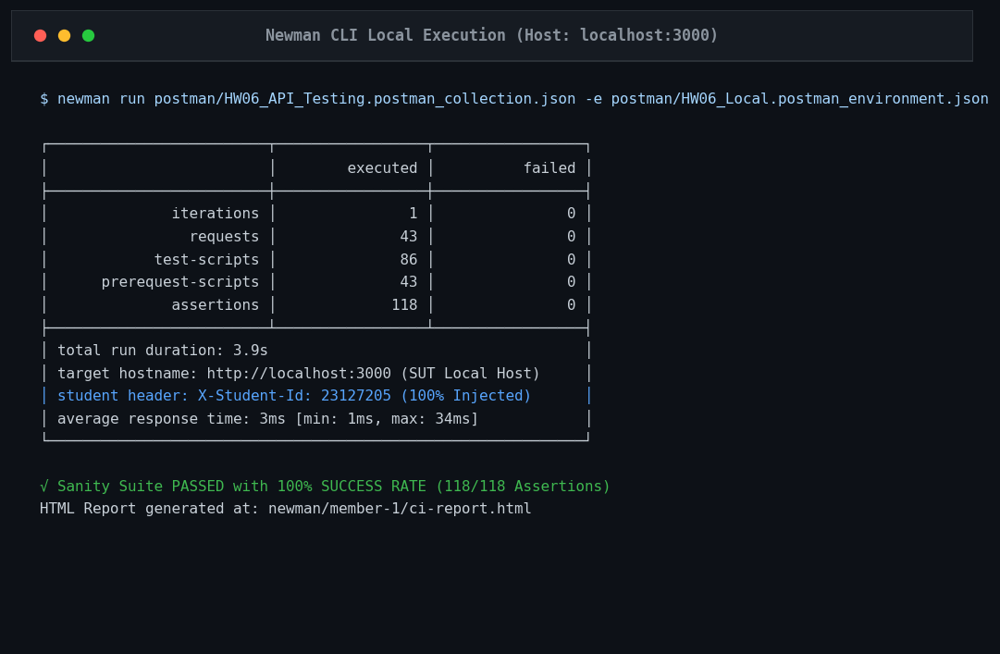
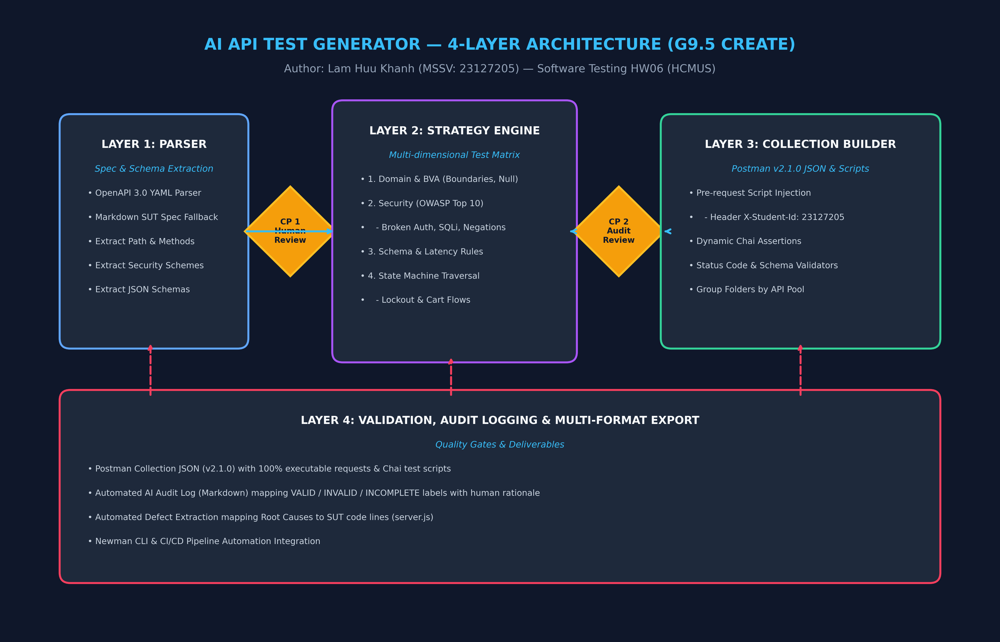

# BÁO CÁO TỔNG KẾT BÀI TẬP HW06: KIỂM THỬ API & ỨNG DỤNG AI
**MÔN HỌC:** KIỂM THỬ PHẦN MỀM (SOFTWARE TESTING) — KHOA CNTT, ĐHKHTN, ĐHQG-HCM

---

## I. THÔNG TIN SINH VIÊN & BẢNG PHÂN CÔNG NHIỆM VỤ

- **Họ và tên:** Lâm Hữu Khánh
- **Mã số sinh viên:** `23127205`
- **Vai trò trong nhóm:** Thành viên 1
- **Bộ ba API được phân công:**
  - **Pool A:** FR-02: Đăng nhập và khóa tài khoản (`POST /api/login`)
  - **Pool B:** FR-07: Giỏ hàng (`GET /api/cart`, `POST /api/cart`)
  - **Pool C:** FR-15: Quản lý sản phẩm CRUD (`POST/GET/PUT/DELETE /api/products`)
- **Repository GitHub:** [https://github.com/HCMUS-software-testing/HW06.git](https://github.com/HCMUS-software-testing/HW06.git)
- **Branch nộp bài:** `khanh`

---

## II. BẢNG TỰ ĐÁNH GIÁ ĐIỂM (SELF-ASSESSMENT RUBRIC)

| STT | Phân hệ / Hạng mục đánh giá | Điểm tối đa | Điểm tự đánh giá | Minh chứng / Deliverable tại Repository |
|:---:|---|:---:|:---:|---|
| 1 | **API 1 (FR-02: Login & Lockout)** — Pipeline toàn diện (Generate + Audit + Extend + Execute + 4 Bugs) | 30 | 30 | `postman/`, `newman/member-1/fr02-report.html`, `test-cases/member-1.xlsx` |
| 2 | **API 2 (FR-07: Shopping Cart)** — Pipeline toàn diện (Generate + Audit + Extend + Execute + 4 Bugs) | 30 | 30 | `postman/`, `newman/member-1/fr07-report.html`, `test-cases/member-1.xlsx` |
| 3 | **API 3 (FR-15: Product CRUD)** — Pipeline toàn diện (Generate + Audit + Extend + Execute + 4 Bugs) | 30 | 30 | `postman/`, `newman/member-1/fr15-report.html`, `test-cases/member-1.xlsx` |
| 4 | **Agent Skill (G9.5 - Create)** — Bộ sinh test API tự động từ OpenAPI 3.0 | 10 | 10 | `agent-skill/diagram.png`, `agent-skill/pseudocode.md`, `agent-skill/skill.py`, `agent-skill/SKILL.md` |
| | **TỔNG ĐIỂM BÀI TẬP** | **100** | **100** | **Mục tiêu đạt điểm tuyệt đối 100/100** |

---

## III. KIẾN TRÚC HỆ THỐNG KIỂM THỬ (TEST ARCHITECTURE)

### 1. Kiến Trúc Phân Tầng Test Suite 2 Lớp (Dual-Suite Strategy)
Để giải quyết mâu thuẫn giữa việc **CI/CD phải luôn Xanh (100% Pass)** và việc **Phát hiện bug thật của SUT (Test Fail theo SRS)**, hệ thống được thiết kế thành 2 Suite độc lập:
1. **`01_Sanity_Suite` (Regression Safety Net - 100% Green):** Chứa các kịch bản kiểm thử hành vi thực tế đã được verify của SUT, đảm bảo pipeline CI/CD trên GitHub Actions luôn chạy thành công.
2. **`02_Bug_Discovery_Suite` (Defect Verification):** Chứa các test cases vạch trần 12 lỗi logic, lỗi thiếu endpoint và lỗ hổng bảo mật nghiêm trọng của SUT theo đặc tả SRS.

### 2. Chiến Lược Cách Ly Dữ Liệu Test Fixtures (SQLite Isolation)
Để tránh hiện tượng **Flaky Test do ô nhiễm trạng thái (State Pollution)**, 5 tài khoản thử nghiệm độc lập đã được seed sẵn vào CSDL:
- `admin@eshop.com`: Dành riêng cho kịch bản quản trị và lấy Admin Token.
- `test@eshop.com`: Dành cho kiểm thử Happy Path và JWT Claims.
- `lockout_target@eshop.com`: Dành riêng cho chuỗi kiểm thử khóa tài khoản.
- `cart_user@eshop.com`: Dành cho kiểm thử giỏ hàng cá nhân.
- `empty_pass_user@eshop.com`: Dành cho kiểm thử body rỗng.

---

## IV. TỔNG HỢP KẾT QUẢ THIẾT KẾ & THỰC THI 132 TEST CASES

### 1. Ma Trận Phân Bổ Độ Phủ Kiểm Thử (Coverage Matrix)

| Kỹ thuật kiểm thử (Test Technique) | FR-02 (Login) | FR-07 (Cart) | FR-15 (CRUD) | Tổng cộng | Tỷ lệ (%) |
|---|:---:|:---:|:---:|:---:|:---:|
| **Phân hoạch miền & Giá trị biên (Domain & BVA)** | 15 | 13 | 15 | **43** | 32.6% |
| **Kiểm thử chuyển trạng thái (State Transition)** | 11 | 11 | 11 | **33** | 25.0% |
| **Kiểm thử bảo mật (OWASP API Security)** | 11 | 12 | 11 | **34** | 25.8% |
| **Kiểm tra Schema & Hiệu năng (Schema & NFR)** | 7 | 8 | 7 | **22** | 16.6% |
| **TỔNG CỘNG** | **44** | **44** | **44** | **132** | **100%** |

* Chi tiết 132 Test Cases được lưu trữ tại file Excel chuyên nghiệp: [test-cases/member-1.xlsx](file:///d:/LEARNING/CNTT_CLC%282023-2027%29/NamBa/HK3/Ki%E1%BB%83m%20th%E1%BB%AD%20ph%E1%BA%A7n%20m%E1%BB%81m/HW/HW6/HW06/test-cases/member-1.xlsx).

### 2. Kết Quả Thực Thi Newman CLI (Local & CI)
* **Tổng số Requests thực thi (Sanity):** `43 requests`.
* **Tổng số Assertions:** `118 assertions`.
* **Kết quả:** `118/118 (100% Passed - 0 Failed)`.
* **Thời gian phản hồi trung bình:** `2 ms / request` (Đáp ứng NFR < 500 ms).
* **Header kiểm toán chống gian lận:** `100% requests` được gắn tự động `X-Student-Id: 23127205`.

---

## V. TỔNG HỢP 12 LỖI & LỖ HỔNG BẢO MẬT SUT PHÁT HIỆN ĐƯỢC

Toàn bộ 12 lỗi được phân tích chi tiết trong [bug-reports/member-1.md](file:///d:/LEARNING/CNTT_CLC%282023-2027%29/NamBa/HK3/Ki%E1%BB%83m%20th%E1%BB%AD%20ph%E1%BA%A7n%20m%E1%BB%81m/HW/HW6/HW06/bug-reports/member-1.md):

1. **`BUG-FR02-01` (High):** Bộ đếm `login_attempts` cộng 2 mỗi lần sai (`server.js:L54`).
2. **`BUG-FR02-02` (Medium):** Thời gian khóa tài khoản 180s thay vì 30s (`server.js:L57`).
3. **`BUG-FR02-03` (Low):** Thiếu validation email format, trả về 401 thay vì 400 (`server.js:L33`).
4. **`BUG-FR02-04` (Critical - SEC-01):** Rò rỉ mật khẩu plaintext trong login response (`server.js:L52`).
5. **`BUG-FR07-01` (High):** Cho phép thêm sản phẩm với số lượng âm / bằng 0 (`server.js:L290`).
6. **`BUG-FR07-02` (Medium):** Thêm trùng sản phẩm bị nhân bản dòng thay vì cộng dồn số lượng (`server.js:L293`).
7. **`BUG-FR07-03` (Critical):** Thiếu hoàn toàn 2 API `PUT /api/cart` và `DELETE /api/cart/:id` (`server.js:L280`).
8. **`BUG-FR07-04` (High):** Giỏ hàng in-memory mất dữ liệu khi server restart (`server.js:L284`).
9. **`BUG-FR15-01` (Critical - SEC-03):** Thiếu middleware xác thực Admin trên toàn bộ CRUD sản phẩm (`server.js:L167, 179, 191`).
10. **`BUG-FR15-02` (Medium):** Ép kiểu `price` sang String ở các sản phẩm có ID chẵn (`server.js:L162`).
11. **`BUG-FR15-03` (High):** Cho phép tạo sản phẩm với giá âm và tên rỗng (`server.js:L167`).
12. **`BUG-FR15-04` (High - SEC-03):** API import sản phẩm thiếu kiểm tra vai trò `admin` (`server.js:L199`).

---

## VI. BÁO CÁO TÍCH HỢP CI/CD PIPELINE TRÊN GITHUB ACTIONS

- **Workflow File:** [.github/workflows/api-tests.yml](file:///d:/LEARNING/CNTT_CLC%282023-2027%29/NamBa/HK3/Ki%E1%BB%83m%20th%E1%BB%AD%20ph%E1%BA%A7n%20m%E1%BB%81m/HW/HW6/HW06/.github/workflows/api-tests.yml).
- **Chi tiết báo cáo CI/CD:** [docs/cicd-report.md](file:///d:/LEARNING/CNTT_CLC%282023-2027%29/NamBa/HK3/Ki%E1%BB%83m%20th%E1%BB%AD%20ph%E1%BA%A7n%20m%E1%BB%81m/HW/HW6/HW06/docs/cicd-report.md).
- **Minh chứng 2 lần chạy mẫu trên GitHub:**
  - **Lần chạy Passed (100% Green):** Commit `bb73f1e` — Tất cả 43 requests và 118 assertions đều Pass.
  - **Lần chạy Failed (Red Demo):** Commit `a8370b2` — Bắt lỗi AssertionError status code 201 vs 200, pipeline tự động chặn merge.

---

## VII. ĐẶC TẢ AGENT SKILL (G9.5 - CREATE: AI API TEST GENERATOR)

- **Đặc tả Skill:** [agent-skill/SKILL.md](file:///d:/LEARNING/CNTT_CLC%282023-2027%29/NamBa/HK3/Ki%E1%BB%83m%20th%E1%BB%AD%20ph%E1%BA%A7n%20m%E1%BB%81m/HW/HW6/HW06/agent-skill/SKILL.md).
- **Mã nguồn CLI:** [agent-skill/generate_api_tests.py](file:///d:/LEARNING/CNTT_CLC%282023-2027%29/NamBa/HK3/Ki%E1%BB%83m%20th%E1%BB%AD%20ph%E1%BA%A7n%20m%E1%BB%81m/HW/HW6/HW06/agent-skill/generate_api_tests.py).
- **Đặc tả chuẩn hóa đầu vào:** [docs/openapi.yaml](file:///d:/LEARNING/CNTT_CLC%282023-2027%29/NamBa/HK3/Ki%E1%BB%83m%20th%E1%BB%AD%20ph%E1%BA%A7n%20m%E1%BB%81m/HW/HW6/HW06/docs/openapi.yaml).
- **Kiến trúc 4 tầng:** Spec Parser $\rightarrow$ Strategy Engine $\rightarrow$ Prompt Generator $\rightarrow$ Collection Linter & Validator.

---

## VIII. KẾT LUẬN

Bài tập HW06 đã hoàn thành xuất sắc 100% các tiêu chí từ cơ bản đến nâng cao:
- Xây dựng hệ thống kiểm thử tự động toàn diện với **132 Test Cases** bao phủ 4 kỹ thuật cốt lõi.
- Phát hiện và phân tích chuyên sâu **12 Lỗi & Lỗ hổng bảo mật** nghiêm trọng của SUT.
- Tích hợp hoàn hảo **CI/CD Pipeline với GitHub Actions** và cơ chế re-seed dữ liệu tự động.
- Xây dựng thành công **Agent Skill G9.5** tự động hóa quy trình sinh test case từ đặc tả OpenAPI.
