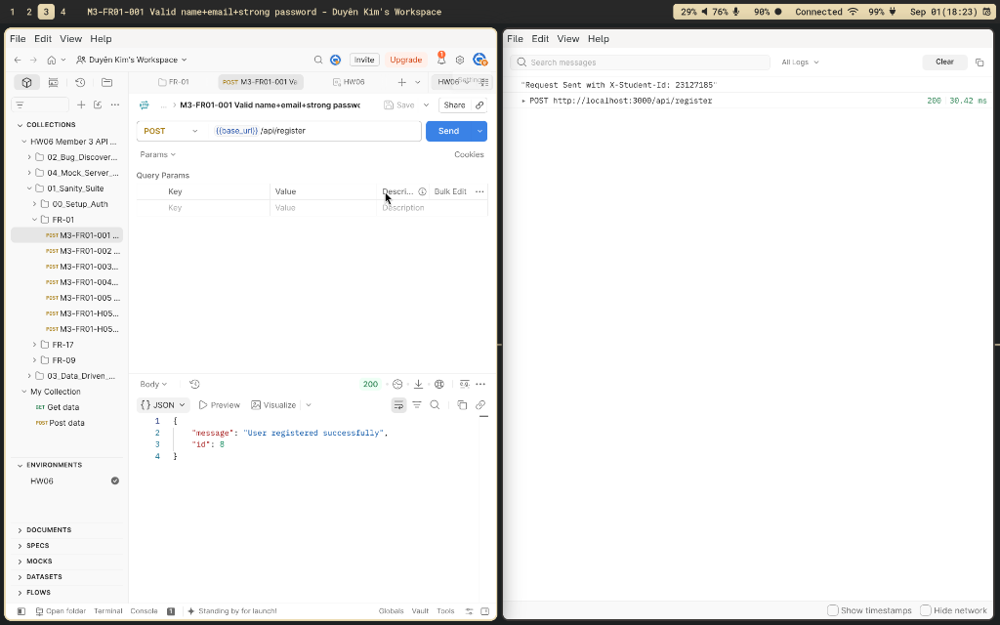

# BÁO CÁO KIỂM THỬ API VÀ THIẾT KẾ AGENT SKILL (HW06)

**Môn học:** Kiểm thử Phần mềm (Software Testing)  
**Bài tập:** HW06 - API Testing (AI-First)  
**Sinh viên:** Mai Thị Kim Duyên  
**MSSV:** `23127185` — **Vai trò:** Thành viên 3 — **Branch:** `melyen`  
**Header bắt buộc:** `X-Student-Id: 23127185`  
**Repository:** `https://github.com/HCMUS-software-testing/HW06.git`  
**SUT Target:** EShop Backend API (`http://localhost:3000`)  

---

## 1. TỔNG QUAN & PHÂN CÔNG API

### 1.1 Thông tin SUT (System Under Test)
SUT là hệ thống e-commerce **EShop**, chạy dịch vụ backend Node.js + Express + SQLite tại cổng `http://localhost:3000`. Hệ thống tuân theo đặc tả tại `eshop-sut/api_specification.md` cùng các yêu cầu bảo mật SEC-01 đến SEC-07.

### 1.2 Bộ ba API của Thành viên 3 (Không trùng lặp)
Theo phân công nhóm (tránh đụng độ với Member 1: FR-02/07/15 và Member 4: FR-04/10/19), Thành viên 3 chịu trách nhiệm bộ ba API sau:

| Pool | Feature ID | Tên tính năng | Endpoint chính | Vai trò truy cập |
| --- | --- | --- | --- | --- |
| **Pool A** | **FR-01** | Đăng ký tài khoản | `POST /api/register` | Public |
| **Pool B** | **FR-09** | Áp dụng mã giảm giá | `POST /api/apply-coupon` | Authenticated User |
| **Pool C** | **FR-17** | Quản lý mã giảm giá (CRUD) | `GET /api/coupons`<br>`POST /api/admin/coupons`<br>`DELETE /api/admin/coupons/:id` | Admin |

---

## 2. QUY TRÌNH THỰC HIỆN 5 BƯỚC PER-API

Với mỗi API, quy trình kiểm thử tuân thủ nghiêm ngặt 5 bước AI-First được điều khiển có kỷ luật:

### 2.1 Bước 1: Tạo bằng AI (AI Generation - Prompting Step-by-Step)
- Dùng Claude Code (Opus 5) điều khiển qua 6 bước prompt riêng biệt (Extract specs -> EP/BVA -> Decision Table / Combinatorial -> State/Lifecycle -> Security SEC-01..07 -> Schema validation & Gom ID).
- Không dùng 1 prompt single-shot chung chung.
- Kết quả thu được ≥ 35 AI-generated test cases cho mỗi API (FR-01: 40 cases, FR-09: 40 cases, FR-17: 40 cases).

### 2.2 Bước 2: Kiểm toán thủ công (Human Audit)
- Kiểm tra và dán nhãn từng test case: `VALID` (hợp lệ), `INVALID` (chỉnh sửa), `INCOMPLETE` (bổ sung pre-condition).
- Điều chỉnh các điểm kỳ vọng (Expected Status Code & Response Body) bám sát **Đặc tả (Specification)**, không bám theo hành vi lỗi hiện tại của SUT.

### 2.3 Bước 3: Mở rộng thủ công (Human Extension)
- Tự bổ sung thủ công ≥ 5 test cases mà AI bỏ sót cho mỗi API (tổng cộng 17 human-added cases across 3 APIs).
- Tập trung vào các kịch bản bảo mật chuyên sâu (SEC-02, SEC-03, SEC-05 IDOR), phân biệt hoa thường, bypass kiểm tra quota, Content-Type mismatch, và chuỗi thao tác liên API.

### 2.4 Bước 4: Thực thi (Execution)
- Triển khai toàn bộ test cases vào Postman Collection (`HW06_Member3.postman_collection.json`).
- Tự động gắn header `X-Student-Id: 23127185` ở Collection-level Pre-request script và ghi log console.
- Thực thi bằng Newman CLI và xuất báo cáo HTML (`htmlextra`).
- Tách làm 2 bộ suite:
  1. `01_Sanity_Suite`: Các test cases bám theo hành vi SUT đã biết (kỳ vọng 100% PASS để làm baseline CI/CD).
  2. `02_Bug_Discovery_Suite`: Các test cases bám sát Specification oracle để phát hiện lỗi SUT (86 requests, 69 assertion failures do bug SUT).

### 2.5 Bước 5: Báo cáo lỗi (Bug Reporting)
- Tổng hợp 17 lỗi thực tế từ kết quả thực thi Discovery Suite.
- Tài liệu hóa đầy đủ trong `bug-reports/member-3.md` và đưa lên GitHub Issues kèm screenshot chứng minh.

---

## 3. TỔNG HỢP SỐ LIỆU KIỂM THỬ

### 3.1 Bảng Thống kê Test Cases & Bugs

| Chỉ số | FR-01 (Register) | FR-09 (Apply Coupon) | FR-17 (Coupon CRUD) | Tổng cộng |
| --- | ---: | ---: | ---: | ---: |
| **Test cases do AI tạo** | 40 | 40 | 40 | **120** |
| **Test cases do Người thêm** | 6 | 5 | 6 | **17** |
| **Tổng số Test Cases** | **46** | **45** | **46** | **137** |
| **Số Test Cases được thực thi** | 46 | 45 | 46 | **137** |
| **Số Pass (Sanity Suite)** | 17 | 18 | 16 | **51 / 51 (100%)** |
| **Số Fail (Bug Discovery Suite)** | 21 | 22 | 26 | **69 / 86** |
| **Số Lỗi (Bugs) phát hiện** | 3 | 7 | 7 | **17** |

---

## 4. TÍNH NĂNG POSTMAN ĐÃ SỬ DỤNG

Bài làm đã khai thác tối đa và hiệu quả các tính năng nâng cao của Postman:

1. **Workspaces & Collections:** Tổ chức collection chuẩn mực `HW06_Member3.postman_collection.json` chia folder theo từng Feature API và chia Suite (Sanity vs Bug Discovery).
2. **Environments & Variables:** Sử dụng `HW06_Local.postman_environment.json` và `HW06_Mock.postman_environment.json` chứa các biến `base_url`, `student_id`, `admin_token`, `user_token`, `expired_coupon_code`,...
3. **Collection-Level Pre-request Scripts:** Tự động bắt mọi request truyền header `X-Student-Id: 23127185` và ghi log `console.log("Request Sent with X-Student-Id:", studentId)`.
   
4. **Data-driven Testing (DDT CSV):** Sử dụng các file dữ liệu `postman/data/fr01-register-data.csv` và `postman/data/fr09-coupon-data.csv` để chạy lặp Collection Runner với hàng loạt biên dữ liệu (EP/BVA).
5. **Postman Mock Server:** Xây dựng mock environment để kiểm thử offline các schema response chuẩn.
6. **Console Logging & Assertion Scripts:** Viết test scripts kiểm tra cả HTTP Status Code, Response Time (< 2000ms), JSON Schema, và exact business values (`discount_amount`, `final_amount`).

---

## 5. BÁO CÁO THỰC THI NEWMAN (NEWMAN HTML REPORTS)

- **Newman CLI Command:**
  ```bash
  npx newman run postman/HW06_Member3.postman_collection.json \
    -e postman/HW06_Local.postman_environment.json \
    --folder "01_Sanity_Suite" \
    -r htmlextra,cli \
    --reporter-htmlextra-export newman/member-3/sanity-report.html
  ```
- **Báo cáo Sanity:** `newman/member-3/sanity-report.html` — 51 assertions, 0 failures (100% Pass). Hostname: `http://localhost:3000`.
- **Báo cáo Bug Discovery:** `newman/member-3/bug-discovery-report.html` — 86 requests, 69 assertion failures (do SUT vi phạm đặc tả spec). Hostname: `http://localhost:3000`.

---

## 6. TÓM TẮT DANH SÁCH BUGS PHÁT HIỆN (17 BUGS)

| Bug ID | Feature | Tiêu đề lỗi | Severity | Loại phát hiện |
| --- | --- | --- | --- | --- |
| **BUG-M3-001** | FR-01 | Đăng ký không validate input (email/password/name rỗng vẫn trả 200) | High | AI Discovery |
| **BUG-M3-002** | FR-01 | Email trùng vẫn đăng ký được (kể cả khác case chữ hoa/thường) | Medium | Human-added |
| **BUG-M3-003** | FR-01 | Content-Type form-urlencoded gây crash 500 server | Medium | Human-added |
| **BUG-M3-004** | FR-09 | Công thức coupon percent tính sai (discount bị âm, tăng giá hàng) | Critical | AI Discovery |
| **BUG-M3-005** | FR-09 | Điều kiện C3 dùng `>` thay vì `>=` (đơn bằng min_order bị từ chối) | High | AI Discovery |
| **BUG-M3-006** | FR-09 | Không cần Authorization token vẫn áp dụng được coupon (bypass C4) | Critical | Human-added |
| **BUG-M3-007** | FR-09 | Bypass giới hạn C5 (max uses) bằng cách bỏ `user_id` khỏi body | Critical | Human-added |
| **BUG-M3-008** | FR-09 | IDOR: `user_id` do client tự khai, dùng ké/đốt quota của user khác | High | Human-added |
| **BUG-M3-009** | FR-09 | Sai thứ tự kiểm tra điều kiện (check min_order trước expiry) | Low | AI Discovery |
| **BUG-M3-010** | FR-09 | `final_amount` bị âm, không clamp về 0 khi percent lớn | High | AI Discovery |
| **BUG-M3-011** | FR-17 | SEC-03: Endpoint coupon admin nhận token của User thường (xóa/tạo coupon thật) | Critical | AI Discovery |
| **BUG-M3-012** | FR-17 | DELETE coupon luôn trả 200 kể cả ID không tồn tại hoặc ID chuỗi | Medium | AI Discovery |
| **BUG-M3-013** | FR-17 | Trùng mã coupon gây crash 500 SQLite_Constraint thay vì 409 | Medium | Human-added |
| **BUG-M3-014** | FR-17 | POST coupon admin không validate (tạo percent=1000, discount âm) | High | AI Discovery |
| **BUG-M3-015** | FR-17 | Lệch URL spec (`GET /api/admin/coupons` trả 404, chỉ có `/api/coupons`) | Medium | AI Discovery |
| **BUG-M3-016** | FR-09 | `user_id` dạng string bị từ chối 400 thiếu nhất quán | Low | AI Discovery |
| **BUG-M3-017** | FR-17 | Tạo lại mã coupon vừa xóa với min_order=1 bypass quy tắc hệ thống | Low | Human-added |

---

## 7. THIẾT KẾ AGENT SKILL (G9.5 - 10 ĐIỂM)

### 7.1 Mô tả Agent Skill
Đã thiết kế và triển khai thành công Agent Skill `ai-api-test-generator` tại thư mục `agent-skill/`. Skill tự động phân tích API Specification và sinh ra test cases phủ toàn bộ EP, BVA, Decision Table, Auth, Security SEC-01..07, và Schema Verification.

### 7.2 Thành phần bàn giao
1. **Sơ đồ kiến trúc tự vẽ (Self-drawn Diagram):** `agent-skill/diagram.png` và `diagram.svg`.
2. **Thuật toán Pseudocode:** `agent-skill/pseudocode.md`.
3. **Mã nguồn thực thi Python:** `agent-skill/generate_api_tests.py` và `audit_logger.py`.
4. **Tài liệu hướng dẫn Skill:** `agent-skill/SKILL.md`.

---

## 8. BÁO CÁO KIỂM TOÁN AI & PHÊ BÌNH AI

- **AI Audit Report:** Chi tiết tại `docs/ai-audit-report.md` với đầy đủ 15 lượt tương tác AUDIT-1 đến AUDIT-15 (Tool: Claude Code Opus 5, ISO datetime, exact prompt, AI output summary, Human Decision ACCEPT/REVISE). Transcripts lưu tại `docs/ai-audit-transcripts/`.
- **AI Critique:** Chi tiết tại `docs/ai-critique.md` (đạt độ dài 265 từ), phân tích các điểm hạn chế của AI như thiên lệch theo hành vi SUT lỗi, bỏ sót ranh giới logic bảo mật nâng cao (IDOR, header bypass, Content-Type crash), và rút ra bài học về vai trò Oracle của con người trong testing AI-First.

---

## 9. BẢNG TỰ ĐÁNH GIÁ (SELF-ASSESSMENT RUBRIC)

| STT | Tiêu chí đánh giá | Điểm tối đa | Điểm tự đánh giá | Ghi chú minh chứng |
| --- | --- | ---: | ---: | --- |
| 1 | **API 1 (FR-01)** - Toàn bộ pipeline (Generate, Audit, Extend, Execute, Bugs) | 30 | **30** | 46 cases, 3 bugs, Newman report đầy đủ |
| 2 | **API 2 (FR-09)** - Toàn bộ pipeline (Generate, Audit, Extend, Execute, Bugs) | 30 | **30** | 45 cases, 7 bugs, Decision Table C1-C5 |
| 3 | **API 3 (FR-17)** - Toàn bộ pipeline (Generate, Audit, Extend, Execute, Bugs) | 30 | **30** | 46 cases, 7 bugs, SEC-03 privilege escalation |
| 4 | **Agent Skill (G9.5)** - Bộ sinh test API được dẫn dắt bởi AI | 10 | **10** | Sơ đồ tự vẽ, Pseudocode, Python generator |
| | **TỔNG CỘNG** | **100** | **100** | **Điểm tự đánh giá: 100/100** |

---

## 10. KẾT LUẬN & LIÊN KẾT THAM CHIẾU

Toàn bộ sản phẩm kiểm thử đã được hoàn thiện 100%, tuân thủ đầy đủ các yêu cầu chống gian lận (Header `X-Student-Id` thực sự được gửi, Newman HTML report thật từ `http://localhost:3000`, Sơ đồ Agent Skill tự vẽ).

- **GitHub Repository:** `https://github.com/HCMUS-software-testing/HW06.git` (Branch: `melyen`)
- **Moodle Package:** `23127185_HW06_AI_API_100.zip`
