# AI API test-generator — design diagram

```mermaid
flowchart LR
  A[API specification + SRS] --> B[Normalize endpoints, actors, fields]
  B --> C[Build partitions, boundaries, state graph, SEC rules]
  C --> D[AI draft generator]
  D --> E[Human audit: VALID / INVALID / INCOMPLETE]
  E --> F[Correct + add missed security/state cases]
  F --> G[Emit CSV / JSON / Postman]
  G --> H[Newman execution with X-Student-Id]
  H --> I[Classify result: defect / expected-negative / fixture issue]
  I --> J[Bug evidence + CI + reports]
```

Design decisions: keep generation, human oracle review, execution, and classification as separate gates; never let an AI-suggested status become an oracle without review; and preserve traceability from requirement to request to evidence.

`diagram.svg` is the editable vector source and `diagram.png` is the rendered hand-designed layout for submission.
