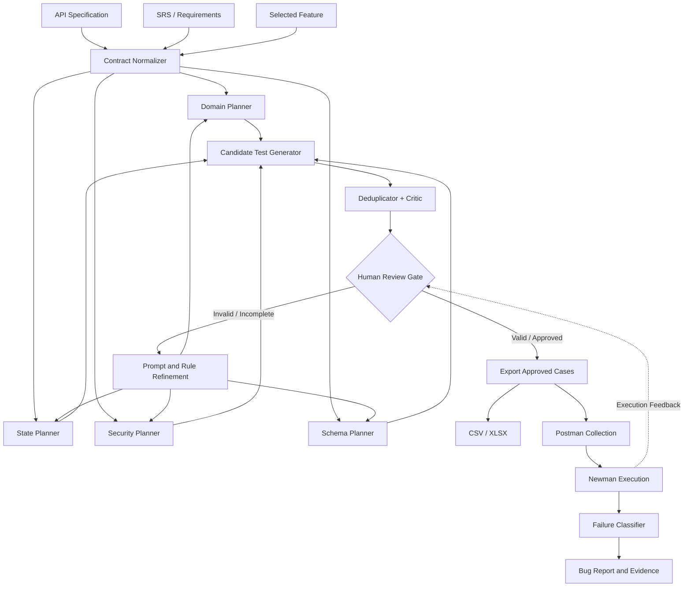

# Sơ đồ thiết kế Agent Skill sinh API test

```mermaid
flowchart TD
    A[API Specification] --> N[Contract Normalizer]
    B[SRS / Requirements] --> N
    C[Selected Feature] --> N

    N --> D[Domain Planner]
    N --> S[State Planner]
    N --> SEC[Security Planner]
    N --> SCH[Schema Planner]

    D --> G[Candidate Test Generator]
    S --> G
    SEC --> G
    SCH --> G

    G --> Q[Deduplicator + Critic]
    Q --> H{Human Review Gate}

    H -->|Invalid / Incomplete| R[Prompt and Rule Refinement]
    R --> D
    R --> S
    R --> SEC
    R --> SCH

    H -->|Valid / Approved| E[Export Approved Cases]
    E --> CSV[CSV / XLSX]
    E --> PM[Postman Collection]
    PM --> X[Newman Execution]
    X --> F[Failure Classifier]
    F --> BE[Bug Report and Evidence]
    X -. Execution Feedback .-> H
```

**Xác nhận của sinh viên:** Tôi tự thiết kế và tự vẽ sơ đồ này: Lê Mai Hoài Bảo — 01/09/2026.
