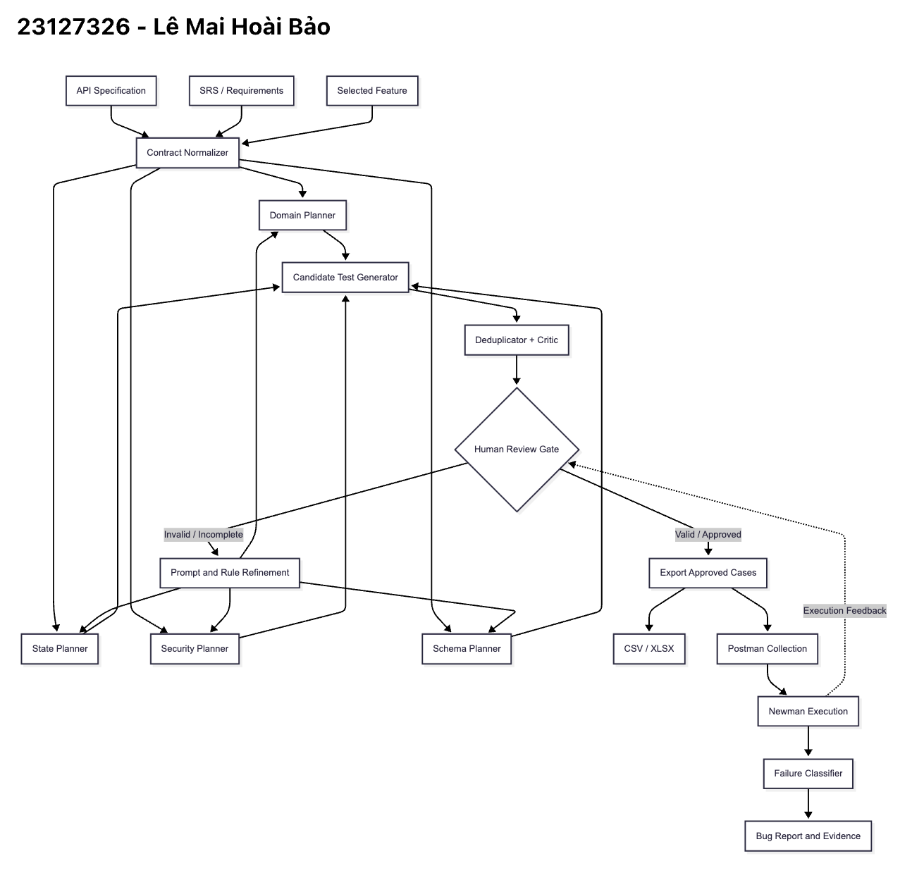

# Ghi chú thiết kế Agent Skill

Sinh viên phải tự vẽ sơ đồ gốc bằng tay. `diagram.png` nộp vào cần thể hiện: đầu vào (API spec, SRS, feature đã chọn), bộ phân tích/chuẩn hóa, bốn planner coverage song song (domain/state/security/schema), bộ sinh candidate, bộ loại trùng/critic, cổng duyệt của người, các exporter (Excel/Markdown/Postman), engine thực thi, minh chứng lỗi và vòng phản hồi từ audit/execution về prompt/rule.

Tiêu chí đạt: mũi tên phải thể hiện luồng dữ liệu; duyệt của người là cổng bắt buộc; execution và bug evidence nằm sau bước duyệt; không dùng AI để tạo ảnh/sơ đồ.

## Các cạnh bắt buộc trong bản sinh viên tự vẽ

1. `API spec + SRS + feature -> Contract normalizer`.
2. `Contract normalizer -> Domain planner / State planner / Security planner / Schema planner`.
3. All four planners `-> Candidate generator -> Deduplicator + critic`.
4. `Deduplicator + critic -> Human review gate`.
5. Rejected/incomplete branch `-> Prompt/rule refinement -> planners`.
6. Approved branch `-> CSV/XLSX + Postman exporters -> Newman execution -> failure classifier -> bug evidence`.
7. Execution feedback `-> Human review gate`.

Sinh viên ghi dưới ảnh: `Tôi tự thiết kế và tự vẽ sơ đồ này: __________ (họ tên/ngày).`
